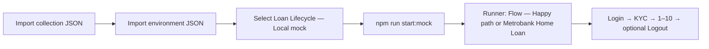

# Loan Lifecycle API Automation — Complete guide

**Stack:** **JavaScript only**, **Node.js 20+**. **Vitest** runs tests; a small **HTTP client** calls API; a **practice bank server** answers locally; **Swagger UI** shows the same contract as `**openapi.json`**.

This guide walks through **install**, **tests**, **mock API**, and **loan lifecycle** (login → … → payoff) in accurate, easy-to-read language.

**Canonical location:** `**docs/DOCUMENTATION.md`** is the **only** full guide. **[README.md](../README.md)** provides project overview and quick start.

---

---

# Loan API Automation

A comprehensive API automation testing framework for loan lifecycle management with mock server, tests, and documentation.

## 🚀 Quick Start

```bash
# Clone and setup
git clone https://github.com/paulabinongo/api-automation-testing.git
cd api-automation-testing
npm install

# Run tests
npm test

# Start mock server with Swagger UI
npm run start:mock
# Visit http://127.0.0.1:8765/docs for interactive API docs
```

## 📋 Overview

- **Mock API Server** - Local development server with full loan lifecycle
- **Automated Tests** - Vitest-based unit and integration tests
- **OpenAPI Contract** - Machine-readable API specification
- **Postman Collections** - Ready-to-import API workflows
- **Documentation** - Complete guide and reference

## 🏗️ Project Structure

```
/
|-- src/                    # Source code
|   |-- api/               # API client code
|   |-- config/            # Configuration files
|   |-- loan-products/     # Loan product logic
|   |   |-- types/         # Loan type definitions (auto, home, personal)
|   |   |-- calculations/  # Computation and eligibility logic
|   |   `-- shared/        # Shared utilities
|   `-- utils/             # Utility functions
|-- tests/                  # All test files
|   |-- unit/              # Unit tests
|   |-- integration/       # Integration tests
|   `-- helpers/           # Test helpers
|-- mock-server/            # Mock API server
|-- config/                 # Development configuration
|-- postman/                # Postman collections and environments
|-- docs/                   # Documentation
`-- scripts/                # Build and automation scripts
```

## 📚 Documentation

**Complete Guide:** [docs/DOCUMENTATION.md](docs/DOCUMENTATION.md)

**Key Sections:**
- Loan lifecycle walkthrough
- API reference and examples
- Testing strategies
- Development workflows
- Product catalog details

## 🔧 Available Scripts

```bash
npm test              # Run all tests
npm run test:watch     # Watch mode for development
npm run test:coverage  # Generate coverage report
npm run start:mock     # Start mock server
npm run lint           # Code linting
npm run format         # Code formatting
```

## 📡 API Endpoints

- **Mock Server:** `http://127.0.0.1:8765`
- **Swagger UI:** `http://127.0.0.1:8765/docs`
- **OpenAPI Spec:** `http://127.0.0.1:8765/openapi.json`

## 🛠️ Tech Stack

- **Node.js 20+** - Runtime environment
- **Vitest** - Testing framework
- **Express** - Mock server
- **OpenAPI 3.0** - API specification
- **Postman** - API testing collections

---

---

## What you get (at a glance)


| Piece                                               | Plain-English purpose                                                                                            |
| --------------------------------------------------- | ---------------------------------------------------------------------------------------------------------------- |
| **Vitest**                                          | Automated checks so changes do not silently break API behavior.                                                  |
| **HTTP client** (`loanApiClient.js`)                | Same URLs as Postman/Swagger, usable from Node tests or scripts.                                                 |
| **Practice API + Swagger**                          | A local “fake bank” plus a browser page to **Try it out** — no real core banking system required.                |
| **OpenAPI** (`mock-server/openapi.json`) | Machine-readable **contract** (paths, JSON shapes). CI validates it. **Swagger** at `**/docs`** loads this file. |


**Sandbox Practice arning:** The **story** matches how many banks talk (KYC, underwriting, funding, disbursement). The **depth** is for **learning and automation**, **not** for regulatory or production sign-off.

---

## How this guide is organized


| Section   | What it is for                                                                                                                                                                                                                                              |
| --------- | ----------------------------------------------------------------------------------------------------------------------------------------------------------------------------------------------------------------------------------------------------------- |
| **§1–2**  | Install Node, `npm install`, and understand `**npm test`** vs **integration** (real server).                                                                                                                                                                |
| **§3**    | Start the mock, open Swagger, fix **port in use**, update OpenAPI when the API changes.                                                                                                                                                                     |
| **§4**    | **Where to edit** paths, sample data, MSW handlers, env vars.                                                                                                                                                                                               |
| **§5**    | **Business view**: happy-path table (**§5.0**), **Metrobank Home Loan** E2E (**§5.0.1**), routes cheat sheet, product catalogue (`**product_code`**, `**product_loan_type`**, `**loan_type**` — **§5.2**), **PEP** gate, edge cases, **real bank vs mock**. |
| **§6–7**  | **File map** and **Postman** (import, environment, Runner).                                                                                                                                                                                                 |
| **§8–11** | **Commands**, **glossary**, **PM/BA checklist**, **automation standards**.                                                                                                                                                                                  |
| **§12**   | **Manual update workflow** — beginner-friendly steps: tweak **Personal** / **Home**, run **another loan** in Postman, or add a **new product type**; keep mock, **OpenAPI**, Swagger, and Postman in sync.                                                |


**Suggested path:** See **[README.md](../README.md)** for quick start, then open **[§5.0](#50-step-by-step-happy-path)** (and **[§5.0.1](#501-metrobank-home-loan--full-e2e-happy-path)** for **Metrobank Home Loan**) when you need the exact call order.

---

## Who should read what?


| If you are…                               | Start here                                                                                                                                                                                                                                            |
| ----------------------------------------- | ----------------------------------------------------------------------------------------------------------------------------------------------------------------------------------------------------------------------------------------------------- |
| **QA or new to repo**                 | [Run tests](#2-run-tests), [Practice API and Swagger](#3-practice-api--swagger), [Glossary](#9-glossary), [§11 Standards](#11-api-automation-standards-this-repo)                                                                                     |
| **Developer changing routes or payloads** | [Modify the project](#4-modify-the-project), [Update Swagger / OpenAPI](#34-update-swagger-and-openapi), [§12 Manual update workflow](#12-manual-update-workflow-loan-lifecycle-artifacts); then use the **checklist table** under [§5.0](#50-step-by-step-happy-path) (*When your real product differs*).                               |
| **PM or BA**                              | [§5 overview](#5-loan-lifecycle-business-view), [§5.0 happy path](#50-step-by-step-happy-path), [§5.4 production mapping](#54-mapping-to-production-bank-lifecycle), [§5.3 edge cases](#53-edge-cases-catalog), [§10 checklist](#10-pm--ba-checklist) |


---

## Table of contents

1. [Prerequisites and setup](#1-prerequisites--setup)
2. [Run tests](#2-run-tests)
3. [Practice API and Swagger](#3-practice-api--swagger)
4. [Modify the project](#4-modify-the-project)
5. [Loan lifecycle (business view)](#5-loan-lifecycle-business-view)
6. [Who uses what and file map](#6-who-uses-what--file-map)
7. [Postman](#7-postman)
8. [Command cheat sheet](#8-command-cheat-sheet)
9. [Glossary](#9-glossary)
10. [PM / BA checklist](#10-pm--ba-checklist)
11. [API automation standards](#11-api-automation-standards-this-repo)
12. [Manual update workflow (loan lifecycle artifacts)](#12-manual-update-workflow-loan-lifecycle-artifacts)


## 1. Prerequisites & setup

### 1.0 In plain words

You need a **computer that can run Node.js**. The project assumes **Node 20+** so scripts, Vitest, and the mock server behave the same on your laptop and in **GitHub Actions**.

You do **not** need Java, Docker, or a database for the default workflow: **JavaScript** + **npm** + this repo are enough.

### 1.1 Install steps

**Why Node 20+?** The project pins a modern LTS-style Node version in `**.nvmrc`** so everyone (and CI) runs the same JavaScript and tooling behavior.

1. **Install Node.js 20 or newer** — from [nodejs.org](https://nodejs.org/) or with **nvm**: `nvm install 20` then `nvm use` (reads `**.nvmrc`**).
2. **Get the project** — clone the repository or copy this folder to your machine. See the script below for cloning via Local HTTPS.

```bash
git clone https://github.com/paulabinongo/api-automation-testing.git
```

1. **Install packages once** (downloads test and dev tools listed in `package.json`):

```bash
cd "/path/to/API AUtomation Testing"
npm install
```

**After install:** The usual `**npm test`** command does **not** need the practice server running. Many tests use **MSW** (Mock Service Worker) to **pretend** the HTTP responses happened, which keeps local runs fast and CI reliable. To also exercise the **real** local socket against the mock API, see [§2.2](#22-terminal--full-suite-practice-api--real-http).

---

## 2. Run tests

**Why two modes?** **Fast checks** (no server) run on every save in many teams; **integration** proves the **mock server** and **client** still agree on URLs and JSON. Both matter.

### 2.0 Two ways tests hit the API (read this first)


| Mode                     | Server needed?         | What happens                                                                                                                                                            |
| ------------------------ | ---------------------- | ----------------------------------------------------------------------------------------------------------------------------------------------------------------------- |
| **Default (`npm test`)** | Usually **no**         | Vitest runs. **MSW** intercepts HTTP from the test and returns fixed mock responses, so logic and client code are checked **in memory**.                                |
| **Full integration**     | **Yes** — practice API | You set `**LOAN_API_BASE_URL`** to something like `**http://127.0.0.1:8765/v1`**. The same tests (where applicable) now make **real HTTP** to your running mock server. |


**Rule of thumb:** If integration tests show as **skipped**, you probably have not set `**LOAN_API_BASE_URL`** to a loopback URL ending in `**/v1`**. The exact check lives in `**src/config/config.js**` (`isLocalMockConfigured`).

### 2.1 Terminal — default (fast, no server)

```bash
npm test
```

Runs **MSW-backed** tests in memory. **Integration** cases stay **skipped** unless `**LOAN_API_BASE_URL`** is exactly a loopback base like `**http://127.0.0.1:<port>/v1`** (any port; the mock’s default port is `**8765**`) — see `**src/config/config.js**` → `**isLocalMockConfigured**`.

- `**tests/unit/**` — exercises **pure logic** (product catalogue rules, eligibility math, loan computation) with **no** fake HTTP layer.
- `**tests/integration/`** — exercises the **HTTP client** with Vitest, using **MSW** unless the real mock URL is configured.

The printed **test count** changes as the suite grows; run `**npm test`** to see the current number.

**Watch mode** (re-run when files change):

```bash
npm run test:watch
```

### 2.2 Terminal — full suite (practice API + real HTTP)

**Terminal 1** — start the API:

```bash
npm run start:mock
```

**Terminal 2**:

```bash
export LOAN_API_BASE_URL=http://127.0.0.1:8765/v1
npm test
```

**Windows PowerShell:** `$env:LOAN_API_BASE_URL="http://127.0.0.1:8765/v1"; npm test`

You should see **all** tests pass: the flow exercises **login → KYC → full loan lifecycle** against the running mock, and **unit** tests still cover **catalogue**, **eligibility**, and **computation** logic.

**Why two terminals?** The practice API is a **separate process**. Integration tests need something listening on the URL you set in `**LOAN_API_BASE_URL`**.

### 2.3 Vitest UI (browser dashboard)

Interactive UI to browse tests, re-run, and inspect results:

```bash
npm run test:ui
```

When it starts, open the URL shown in the terminal (often `http://localhost:51204/__vitest__/`).  
This is for **tests**, not for calling the loan API (use **Swagger** or **Postman** for that).

### 2.4 Understanding results


| Result      | Meaning                                                                                           |
| ----------- | ------------------------------------------------------------------------------------------------- |
| **Passed**  | Behavior matches assertions.                                                                      |
| **Failed**  | Note the **test name** (it describes the rule); fix code or update tests if requirements changed. |
| **Skipped** | Usually integration tests when `LOAN_API_BASE_URL` isn’t set to `**http://127.0.0.1:<port>/v1`**. |


### 2.5 Quality gate commands (local / CI)


| Command                    | Role                                                                                                                                                                                                                                                                          |
| -------------------------- | ----------------------------------------------------------------------------------------------------------------------------------------------------------------------------------------------------------------------------------------------------------------------------- |
| `npm run validate:openapi` | Confirms `**mock-server/openapi.json`** parses and `**$ref`**s resolve (contract discipline).                                                                                                                                                                      |
| `npm run lint`             | **ESLint** on `javascript/` and `scripts/` (style + common bugs).                                                                                                                                                                                                             |
| `npm run format:check`     | **Prettier** check on JS sources (no drift without `npm run format`).                                                                                                                                                                                                         |
| `npm run test:coverage`    | Vitest + **coverage** with **thresholds** on `loanApiClient`, `config`, `sampleData`, `loanConstants` (the automation-facing surface).                                                                                                                                        |
| `npm run test:integration` | Starts `**start:mock`** on **port 9876** (avoids clashing with a dev server on **8765**), waits for `**/openapi.json`**, runs full Vitest with `**LOAN_API_BASE_URL=http://127.0.0.1:9876/v1`** and `**DRAFT_MIN_RETENTION_MS=100**` (faster **DELETE DRAFT** policy checks). |
| `npm run ci`               | OpenAPI → lint → format → coverage → integration — matches **GitHub Actions** workflow.                                                                                                                                                                                       |


Node **20+** is required (see `**.nvmrc`**); CI uses **ubuntu-latest** + **Node 20**.

**Typical daily flow for developers:** `**npm test`** while coding; `**npm run ci`** (or push to a PR) before merge; `**npm run test:integration**` when you touched `**server.js**` or `**openapi.json**`.

---

## 3. Practice API & Swagger

The **practice API** is a small **Express**-style server in `**mock-server/server.js`**. It exposes the same JSON routes your tests and Postman use, and serves **Swagger UI** so you can explore and try endpoints in a browser.

**Typical uses**

- **Learning** — click through the lifecycle in order with **Try it out**.
- **Debugging** — compare your request body with what **422** validation errors expect.
- **Demos** — show stakeholders a **working** API without wiring to a real bank.

### 3.1 Start the server

```bash
npm run start:mock
```

Default: **[http://127.0.0.1:8765](http://127.0.0.1:8765)** (`PORT` and `HOST` env vars optional).

**DRAFT retention (mock policy):** `**POST /v1/loan-applications`** sets `**draft_created_at`**. `**DELETE /v1/loan-applications/{applicationId}**` abandons a **DRAFT** only after a **minimum retention** period — **60 seconds** by default — so the system or borrower cannot cancel a fresh draft inside that window (**409**). That **409** returns `**Retry-After`** (seconds) and **Problem Details**-style JSON (`**type`**, `**title**`, `**retry_after_seconds**`). Lower the threshold for tests with `**DRAFT_MIN_RETENTION_MS**` (e.g. `**100**`; `**npm run test:integration**` sets this on the mock and Vitest). Optional `**Idempotency-Key**` on **DELETE** replays **204** after a successful cancel. Successful cancels emit `**[audit] draft_cancelled`** on **stderr** (structured JSON line). **Server-side** auto-removal of stale **DRAFT**s defaults to **3 minutes** after `**draft_created_at`** (never sooner than `**DRAFT_MIN_RETENTION_MS**` / **60** s). Override with `**DRAFT_SYSTEM_CANCEL_AFTER_MS`** (ms). Set `**DRAFT_SYSTEM_CANCEL_AFTER_MS**` to **0**, **false**, **off**, or **no** to disable.

### 3.2 Try in the browser


| What                                | URL                                                                                                                                                                                                                                                                                                                                                                                                                                                                                                                                                                              |
| ----------------------------------- | -------------------------------------------------------------------------------------------------------------------------------------------------------------------------------------------------------------------------------------------------------------------------------------------------------------------------------------------------------------------------------------------------------------------------------------------------------------------------------------------------------------------------------------------------------------------------------- |
| **Swagger UI** (“Try it out”)       | [http://127.0.0.1:8765/docs](http://127.0.0.1:8765/docs) — **Reference** tag has **health**, **loan-products**, **loan-computation-preview** (no auth); then **POST /auth/login** + **Authorize** for the rest                                                                                                                                                                                                                                                                                                                                                                   |
| **OpenAPI JSON** (machine-readable) | [http://127.0.0.1:8765/openapi.json](http://127.0.0.1:8765/openapi.json) — same contract Swagger renders; `**info.version`** (e.g. **0.8.25**) tracks releases; describes **PERSONAL_LOAN** and **HOME_LOAN** plus catalogue `**product_loan_type`** / `**loan_type**` (see [§5.2](#52-product-catalogue-terms--payment-rails-mock-lovs)); `**HOME_LOAN**` documents `**metrobank_lifecycle_phases**` via `**MetrobankHomeLoanLifecyclePhase**` and `**LoanProductCatalogEntry**`; `**info.description**` points at `**loan-products/**` and `**productLoanTaxonomy.js**` (§**6) |
| **Root**                            | Redirects to `/docs`                                                                                                                                                                                                                                                                                                                                                                                                                                                                                                                                                             |


**Postman:** import `**postman/collection/Loan_Lifecycle_API.postman_collection.json`** and `**postman/environments/Local_Mock.postman_environment.json`** (select that environment); full steps are in [§7 Postman](#7-postman).

### 3.3 Port already in use (`EADDRINUSE`)

Another process (or an old server) is using **8765**. Either:

```bash
lsof -ti tcp:8765 | xargs kill   # macOS / Linux
```

Or run on another port:

```bash
PORT=8766 npm run start:mock
```

If you use a non-default port, set `LOAN_API_BASE_URL` to that port on `**127.0.0.1**` (integration tests match any loopback port; **8765** is only the default in `**npm run start:mock`**).

### 3.4 Update Swagger and OpenAPI

Swagger is driven by `**mock-server/openapi.json`** (served as `/openapi.json`). Keep it in sync when the API changes.

1. **Change behavior** — edit `**mock-server/server.js`** (routes, validation, responses).
2. **Change the contract docs** — edit `**mock-server/openapi.json`**:
  - `**paths`** — add or adjust URL templates (`/v1/...`), methods, `requestBody`, `responses`, examples.
  - `**components.schemas**` — reuse field shapes; add new schemas for new bodies. **Home Loan catalogue:** when `**metrobank_lifecycle_phases`** (or related `**LoanProductCatalogEntry`** fields) change in `**homeLoanCatalog.js**`, align `**MetrobankHomeLoanLifecyclePhase**`, `**MetrobankHomeLoanLifecyclePhaseState**` (`**metrobank_home_loan_lifecycle_phase**` on `**ApplicationOut**` / `**LoanOut**`), `**DocumentRegistrationIn**` (**HOME_LOAN** LOS fields), `**HomeLoanBookingFeesIn`**, path `**POST …/home-loan/fees/booking`**, and `**metrobankHomeLoanLifecyclePhase.js**` / `**homeLoanLosValidation.js**` mapping, descriptions on `**GET /reference/loan-products**`, bump `**info.version**`, and refresh **Postman** + **§5.0.1** in this guide.
3. **Restart** — `npm run start:mock` and hard-refresh `**/docs`** in the browser (Swagger always loads the same `**openapi.json`**).
4. **Keep clients aligned** — update `**src/api/loanApiClient.js`**, `**javascript/test/**/\*.test.js`** (and MSW handler URLs/bodies), and Postman if paths or JSON differ. PEP gate: keep `**POST …/compliance/pep-clearance**`, `**ApplicationOut**`, and **submit** error text aligned with `**server.js`** and **§5.0** / **§5.0.1** / Step **7b in this guide.

**Tip:** Valid JSON is required. Validate with:

```bash
node -e "JSON.parse(require('fs').readFileSync('mock-server/openapi.json','utf8')); console.log('OK')"
```

---

## 4. Modify the project

When you add an endpoint or change a JSON field, **one change is rarely enough**: the **server** must implement it, **OpenAPI** must describe it, the **client** and **tests** must use it, and **Postman** should stay demo-ready.


| Goal                           | Files                                                                                                                      | Why it matters                                                                     |
| ------------------------------ | -------------------------------------------------------------------------------------------------------------------------- | ---------------------------------------------------------------------------------- |
| **Paths / HTTP methods**       | `src/api/loanApiClient.js`, `mock-server/server.js`, `mock-server/openapi.json`, Postman JSON | **Single URL shape** everywhere — otherwise tests pass locally but demos fail.     |
| **Sample data**                | `src/utils/sampleData.js`                                                                                             | Builders for **examples** in tests and copy-paste bodies.                          |
| **Fake responses (no server)** | MSW handlers in `tests/integration/loanLifecycle.test.js`, `tests/integration/loanEdgeCases.test.js`   | Keeps `**npm test`** fast when the mock is **not** running.                        |
| **When integration tests run** | `src/config/config.js` (`isLocalMockConfigured`, env vars)                                                             | Flips tests from **mocked HTTP** to **real HTTP** when `LOAN_API_BASE_URL` is set. |
| **Env / secrets**              | `.env` (not committed), `LOAN_API_BASE_URL`, `LOAN_API_KEY`                                                                | Point at **local mock** or a **staging** host without committing secrets.          |


**Real staging API:** set `**LOAN_API_BASE_URL`** (and optional `**LOAN_API_KEY`**) before `**npm test**`. Paths and headers must still match `**loanApiClient.js**`.

---

## 5. Loan lifecycle (business view)

This section is written for **anyone** who needs to understand **what the API is modeling**, not only engineers.

**Two halves of the same story**

- **Origination (front half):** everything from **“new customer / new application”** through **underwriting decision** — is the bank willing to lend, and on what conditions?
- **Servicing (back half):** after money moves — **payments**, **balance**, and **closing** the loan when it is paid off.

Both are in **one API** so you can practice the **full arc** in one place.

**Origination + servicing** are combined in one **teachable** API. The **order of steps** and the **words we use** follow a path many banks recognize:

KYC → customer **intake** → **operations / processing** → **initial disclosures** → **credit check** → **underwriting queue** → **decision** → **clear to close** → **funding approval** → **book / fund** on the ledger → **disburse** cash to the borrower → **collect payments** → **close** the loan.

That mirrors how **Loan Origination Systems (LOS)** — software used to take applications and decisions — and **funding desks** often hand work to each other. This is still a **sandbox**: steps are **compressed** (seconds, not weeks), outside vendors are **not** really called, and rules are **simplified**. For **how this compares to real production**, read [§5.4](#54-mapping-to-production-bank-lifecycle).

**IDs to remember**

- After you **create an application**, you mainly care about `**application_id`**.
- `**loan_id` appears only after underwriting approves (or conditionally approves)** and the system creates a **loan** record. Until then, routes under `**/loans/...`** do not apply.

### 5.0 Step-by-step happy path

#### Context (read this before the table)

**The lifecycle in one breath:** prove who you are (**KYC**) → fill a **draft application** → (**optional** eligibility preview, **optional** PATCH edits → **optional** payment preview) → register **which ID you will upload** → if the borrower is **not yet** a Metrobank **deposit** client but will open an account for **ADA**, complete **Metrobank deposit confirmation** → if **PEP** answers are “yes”, complete a **compliance clearance** call → **submit** → ops **accept** → sign off **disclosures** → **credit** → **underwriting** (decision may add **stips**) → **fund** path (**authorize** → **book** → **disburse**) → **payments** → **payoff**/**close**.

**Application vs loan — think “file” vs “contract”**


| Concept         | Think of it as…                                                                                                                                   |
| --------------- | ------------------------------------------------------------------------------------------------------------------------------------------------- |
| **Application** | The borrower’s **folder** while the bank is still deciding — all `**.../loan-applications/...`** steps until **funding** work uses `**loan_id`**. |
| **Loan**        | The **legal / booked obligation** once underwriting creates it — `**/loans/{loanId}/...`** for funding, disbursement, payments.                   |


**Postman step labels vs this guide**

- In the **Postman** happy-path folder, **“1d”** is **PEP compliance clearance** (`POST …/compliance/pep-clearance`).
- In the **table below**, the same step is **1c-PEP** so it sits **right after** document step **1c** (easier to read in a spec).
- **Computation preview** tied to an existing application is `**GET .../loan-computation-preview`**; in **§5.1** that row is **1d** — different from Postman’s **1d** name. When in doubt, follow the **HTTP method + path**, not only the step number.

**How to use this table:** Work **top to bottom**. Use the same order in **Swagger**, **Postman**, or your own app. Almost every `**/v1`** call needs a **Bearer token** from **login**. **Creating a loan application** also needs **KYC** completed first, or the server responds with **403**.

**Calls you can make before login (no Bearer):**

- `**GET /v1/health`** — simple alive check.
- `**GET /v1/reference/loan-products`** — catalogue for all registered `**product_code**` values (**PERSONAL_LOAN**, **HOME_LOAN**, …): terms, limits, LOVs, fees — built from `**src/loanProductCatalog.js`** (`**buildLoanProductReferencePayload`**). Each row includes `**product_loan_type**` (`**PERSONAL**` = consumer retail, incl. unsecured / home / car-style products; `**BUSINESS**` = commercial-only when such a product exists) and `**loan_type**` (narrower family slug, e.g. `**personal**`, `**home**`, `**car**`) — constants in `**src/utils/productLoanTaxonomy.js**`.
- `**GET /v1/reference/loan-computation-preview**` — preview of interest, fees, net proceeds, and **EIR** for sample `**principal_cents`** / `**term_months`**; optional `**product_code**` / `**loan_purpose**` (**HOME_LOAN**); for **HOME_LOAN**, optional `**interest_fixing_years`** (**1–5**, default **1**) selects the **initial interest fixing** (Metrobank calculator), independent of `**term_months`** (**1–25** years in **12**-month steps). Dispatch: `**src/loan-products/calculations/computationRegistry.js`**.

Everything else in the happy path expects `**Authorization: Bearer <access_token>`**.


| #                             | What happens (plain English)                                    | API call                                                                                                                   | Body / notes                                                                                                                                                                                                                                                                                                                                                                                                                                                                                                                                                                                                                                                                                                                                                                                                                                   | You need                                                                 | You get / save                                                                                                                               |
| ----------------------------- | --------------------------------------------------------------- | -------------------------------------------------------------------------------------------------------------------------- | ---------------------------------------------------------------------------------------------------------------------------------------------------------------------------------------------------------------------------------------------------------------------------------------------------------------------------------------------------------------------------------------------------------------------------------------------------------------------------------------------------------------------------------------------------------------------------------------------------------------------------------------------------------------------------------------------------------------------------------------------------------------------------------------------------------------------------------------------- | ------------------------------------------------------------------------ | -------------------------------------------------------------------------------------------------------------------------------------------- |
| **—**                         | **Log in** (session).                                           | `POST /v1/auth/login`                                                                                                      | **Public** — no `Authorization` header. JSON: `**email`**, `**password`**. Sandbox accepts `**demo**` or `**demo123**`.                                                                                                                                                                                                                                                                                                                                                                                                                                                                                                                                                                                                                                                                                                                        | —                                                                        | `**access_token**` — send as `Authorization: Bearer <token>` on all later steps.                                                             |
| **—**                         | **Customer KYC** (onboarding).                                  | `POST /v1/onboarding/kyc`                                                                                                  | `**full_name`**, `**email`**, `**date_of_birth**` (YYYY-MM-DD), `**national_id_last4**` (4 digits).                                                                                                                                                                                                                                                                                                                                                                                                                                                                                                                                                                                                                                                                                                                                            | Bearer                                                                   | `**VERIFIED**` (simulated). **403** on create loan if skipped.                                                                               |
| **1**                         | Start a new application (draft).                                | `POST /v1/loan-applications`                                                                                               | **PERSONAL_LOAN:** `**metrobank_client_type`**, `**loan_purpose`**, `**additional_information**` (PEP; optional `**metrobank_deposit_repayment_plan**` for `**NOT_METROBANK_CLIENT**` / `**EXISTING_CLIENT_CREDIT_CARD**`), `**borrower**`, `**employment**` (see §5.2). HOME_LOAN: `**product_code**` `**HOME_LOAN**` — `**metrobank_client_type**` (**same ADA / deposit rules as Personal Loan**), `**loan_purpose`**, `**additional_information`** (PEP; optional `**metrobank_deposit_repayment_plan**`; `**property_appraised_value_cents**`, `**home_loan_applicant_category**`, collateral booleans, `**no_adverse_credit_history**`), same `**borrower**` / `**employment**` shape — [§5.0.1](#501-metrobank-home-loan--full-e2e-happy-path). Eligibility must pass (**422** if not). Principal = **whole PHP** (centavos **÷ 100**). | Bearer + KYC done                                                        | `**application_id`** ← response `**id`**. `**loan_id` is `null**` (normal).                                                                  |
| **1a** *(optional)*           | Check eligibility only (review screen **Next**).                | `POST /v1/loan-applications/eligibility-preview`                                                                           | Same JSON as create; **no** draft persisted.                                                                                                                                                                                                                                                                                                                                                                                                                                                                                                                                                                                                                                                                                                                                                                                                   | Bearer + KYC                                                             | `**eligible`**, `**checks`**, `**failed_checks**`.                                                                                           |
| **1b** *(optional)*           | Fix **DRAFT** after review (**Edit** / back).                   | `PATCH /v1/loan-applications/{applicationId}`                                                                              | Partial merge of amount / term / **borrower** / **employment** / prerequisite; re-validates. Changing **borrower.primary_id_document_type** clears prior document registration.                                                                                                                                                                                                                                                                                                                                                                                                                                                                                                                                                                                                                                                                | Bearer + **application_id** (**DRAFT**, same session)                    | Updated **DRAFT**.                                                                                                                           |
| **1b-DEL** *(optional)*       | Abandon **DRAFT** (borrower cancel).                            | `DELETE /v1/loan-applications/{applicationId}`                                                                             | No body. **204** removes the draft (**Idempotency-Key** replays **204**). **409** if not **DRAFT** or younger than **minimum retention** (**§3.1**): `**Retry-After`**, `**type`**, `**title**`, `**retry_after_seconds**`. `**[audit] draft_cancelled**` in server log.                                                                                                                                                                                                                                                                                                                                                                                                                                                                                                                                                                       | Bearer + **application_id** (**DRAFT**, same session)                    | **—** (no JSON body).                                                                                                                        |
| **1c**                        | Confirm document upload ID (**Step 7**).                        | `POST /v1/loan-applications/{applicationId}/documents`                                                                     | `**primary_id_document_type`** must equal **borrower.primary_id_document_type** (**422** if not).                                                                                                                                                                                                                                                                                                                                                                                                                                                                                                                                                                                                                                                                                                                                              | Bearer + **application_id** (**DRAFT**)                                  | `**document_intake`** set — required before **submit**.                                                                                      |
| **1c-MB** *(conditional)*     | Metrobank **deposit for ADA** confirmation (**Step 7c**).       | `POST /v1/loan-applications/{applicationId}/metrobank-deposit-account/confirm`                                             | **PERSONAL_LOAN** and **HOME_LOAN**. Body `{}`. When `**metrobank_client_type`** is `**NOT_METROBANK_CLIENT`** or `**EXISTING_CLIENT_CREDIT_CARD**` and `**additional_information.metrobank_deposit_repayment_plan**` is `**WILL_OPEN_METROBANK_DEPOSIT**`. **400** if `**EXISTING_CLIENT_DEPOSIT_ACCOUNT`** (confirm not needed). **409** if **1c** not done, plan is missing or not `**WILL_OPEN_METROBANK_DEPOSIT`**, or status is past underwriting queue (not DRAFT / SUBMITTED / IN_PROCESSING / CREDIT_COMPLETED / IN_UNDERWRITING). Re-runs eligibility (422 if failed). Sets `**metrobank_deposit_account_confirmed_at`** (cleared when **PATCH** changes `**additional_information`** or `**metrobank_client_type`**).                                                                                                               | Bearer + **application_id** after **1c** (up to **IN_UNDERWRITING**)     | Timestamp required before **underwriting** can **APPROVE** / **CONDITIONAL** when `**WILL_OPEN_METROBANK_DEPOSIT`** (not before **submit**). |
| **1c-PEP** *(conditional)*    | Compliance / EDD gate (**Step 7b**) when Step **6** is **Yes**. | `POST /v1/loan-applications/{applicationId}/compliance/pep-clearance`                                                      | Body `{}`. **Only** if **either** `**additional_information`** PEP boolean is `**true`** (**400** if both `**false`**). 409 if 1c not done or not DRAFT. Sets `**pep_compliance_clearance_at`**; **PATCH** to `**additional_information`** clears it.                                                                                                                                                                                                                                                                                                                                                                                                                                                                                                                                                                                          | Bearer + **application_id** (**DRAFT**) after **1c**                     | May `**GET`** application to confirm `**pep_compliance_clearance_at`**.                                                                      |
| **2**                         | Send the application to processing.                             | `POST /v1/loan-applications/{applicationId}/submit`                                                                        | No body. **1c** required (**409** if skipped). **PERSONAL_LOAN** / **HOME_LOAN:** **1c-MB** is **not** required for **submit**; **underwriting** **APPROVE** / **CONDITIONAL** stay **422** until `**metrobank_deposit_account_confirmed_at`** when `**NOT_METROBANK_CLIENT`** or `**EXISTING_CLIENT_CREDIT_CARD**` with `**WILL_OPEN_METROBANK_DEPOSIT**`. If **either** PEP boolean `**true`**, **1c-PEP** required (**409** if skipped).                                                                                                                                                                                                                                                                                                                                                                                                    | **application_id** from step 1                                           | Status **SUBMITTED**.                                                                                                                        |
| **3**                         | Ops / processing accepts the file (LOS queue).                  | `POST /v1/loan-applications/{applicationId}/processing/accept`                                                             | No body.                                                                                                                                                                                                                                                                                                                                                                                                                                                                                                                                                                                                                                                                                                                                                                                                                                       | **application_id**                                                       | Status **IN_PROCESSING**.                                                                                                                    |
| **4**                         | Initial disclosures acknowledged (sandbox gate).                | `POST /v1/loan-applications/{applicationId}/disclosures/acknowledge`                                                       | Optional: `{ "package_version": "…" }` (ignored by validation).                                                                                                                                                                                                                                                                                                                                                                                                                                                                                                                                                                                                                                                                                                                                                                                | **application_id**                                                       | `**disclosures_acknowledged_at`** set — required before credit.                                                                              |
| **5**                         | Run credit (sandbox pass/fail).                                 | `POST /v1/loan-applications/{applicationId}/credit-check`                                                                  | e.g. `{ "force_outcome": "PASS" }` for demos.                                                                                                                                                                                                                                                                                                                                                                                                                                                                                                                                                                                                                                                                                                                                                                                                  | **application_id**                                                       | **CREDIT_COMPLETED** (or **DECLINED** — **stop**).                                                                                           |
| **6**                         | Underwriting queue (file with underwriter).                     | `POST /v1/loan-applications/{applicationId}/underwriting/start`                                                            | No body.                                                                                                                                                                                                                                                                                                                                                                                                                                                                                                                                                                                                                                                                                                                                                                                                                                       | **application_id**                                                       | Status **IN_UNDERWRITING**.                                                                                                                  |
| **7**                         | Underwriter approves (or adds conditions).                      | `POST /v1/loan-applications/{applicationId}/underwriting/decision`                                                         | e.g. `{ "outcome": "APPROVE" }` OR conditional with **stipulations** array.                                                                                                                                                                                                                                                                                                                                                                                                                                                                                                                                                                                                                                                                                                                                                                    | **application_id**                                                       | `**loan_id`** ← `**loan.id`**. If **DECLINE**, `**loan`** is null — stop.                                                                    |
| **8** *(only if conditional)* | Clear stips — **all at once** or **one UUID at a time**.        | `POST /v1/loan-applications/{applicationId}/stipulations/fulfill-all` **or** `POST …/stipulations/{stipulationId}/fulfill` | **fulfill-all:** no body; response has `**fulfilled_stipulation_ids`**.                                                                                                                                                                                                                                                                                                                                                                                                                                                                                                                                                                                                                                                                                                                                                                        | **application_id**; per-stip needs each `**stipulation.id`** from step 7 | Application **APPROVED_CLEAR_TO_CLOSE**, loan **PENDING_FUNDING**.                                                                           |
| **9**                         | Funding desk clears loan to book (secondary approval).          | `POST /v1/loans/{loanId}/funding/authorize`                                                                                | No body.                                                                                                                                                                                                                                                                                                                                                                                                                                                                                                                                                                                                                                                                                                                                                                                                                                       | **loan_id**                                                              | Loan **CLEARED_FOR_BOOKING**; `**funding_authorized_at`** set.                                                                               |
| **10**                        | Book the loan on the bank’s books (“fund”).                     | `POST /v1/loans/{loanId}/fund`                                                                                             | No body. Only after **authorize**.                                                                                                                                                                                                                                                                                                                                                                                                                                                                                                                                                                                                                                                                                                                                                                                                             | **loan_id**                                                              | Loan **FUNDED**; `**funded_at`** set (proceeds **not** sent yet).                                                                            |
| **11**                        | Pay the borrower (“disburse”).                                  | `POST /v1/loans/{loanId}/disburse`                                                                                         | No body. Only after **fund**.                                                                                                                                                                                                                                                                                                                                                                                                                                                                                                                                                                                                                                                                                                                                                                                                                  | **loan_id**                                                              | Loan **ACTIVE**; `**disbursed_at`**.                                                                                                         |
| **12** *(optional)*           | Preview payment dates.                                          | `GET /v1/loans/{loanId}/payment-schedule`                                                                                  | —                                                                                                                                                                                                                                                                                                                                                                                                                                                                                                                                                                                                                                                                                                                                                                                                                                              | **loan_id**                                                              | Demo schedule JSON.                                                                                                                          |
| **13**                        | Customer pays down balance.                                     | `POST /v1/loans/{loanId}/payments`                                                                                         | `{ "amount_cents": N, "method": "ACH" }`                                                                                                                                                                                                                                                                                                                                                                                                                                                                                                                                                                                                                                                                                                                                                                                                       | **loan_id**                                                              | Balance drops; **PAID_OFF** if balance hits 0.                                                                                               |
| **14**                        | Close the loan on the system.                                   | `POST /v1/loans/{loanId}/payoff`                                                                                           | No body.                                                                                                                                                                                                                                                                                                                                                                                                                                                                                                                                                                                                                                                                                                                                                                                                                                       | **loan_id**                                                              | Status **CLOSED**.                                                                                                                           |
| **—**                         | **Log out** (invalidate token).                                 | `POST /v1/auth/logout`                                                                                                     | No body.                                                                                                                                                                                                                                                                                                                                                                                                                                                                                                                                                                                                                                                                                                                                                                                                                                       | Bearer                                                                   | **204** — reuse requires **login** again.                                                                                                    |


**Remember:** `**loan_id` does not exist until step 7** (underwriting decision) creates the loan. Until then only `**application_id`** matters. Helpers in `**tests/integration/flowHelpers.js`** (`throughCredit`, `throughUnderwritingDecision`, `activeLoan`) chain these steps for **Vitest**; `**LoanApiClient`** exposes each **POST** separately for Postman and app code.

### 5.0.1 Metrobank Home Loan — full E2E happy path

This is the same **API sequence** as [§5.0](#50-step-by-step-happy-path), told for **Metrobank Home Loan (Residential)** (`product_code`: `**HOME_LOAN`**). Intake includes `**metrobank_client_type`** and the same Metrobank ADA / `**POST …/metrobank-deposit-account/confirm**` rules as **Personal Loan** (see **§5.2** `**metrobank_client_prerequisite`** on `**GET /reference/loan-products`**). **Step 7** still requires `**POST …/documents`**; **Step 6** PEP rules and **1c-PEP** are unchanged.

#### Metrobank Home Loan application form (field constraints)

The public **Metrobank Home Loan** web form maps to this API as follows. Server validation lives in `**validateHomeLoanIntakeShape`** (`**src/loanProductCatalog.js`**); eligibility (amount, LTV, income, age, tenure) in `**evaluateHomeLoanEligibility**` (`**src/loan-products/types/home-loan/homeLoanEligibility.js**`). **OpenAPI** `**info.version`** **0.8.25** documents the same shapes (`**BorrowerIn`**, `**AdditionalInformationIn`**, `**PresentHomeAddressIn**`, `**BorrowerConsentsIn**`).


| Metrobank form concept                                       | API field(s)                                                                                                                                                                                                                                                               | Mock rule (summary)                                                                                                                                                              |
| ------------------------------------------------------------ | -------------------------------------------------------------------------------------------------------------------------------------------------------------------------------------------------------------------------------------------------------------------------- | -------------------------------------------------------------------------------------------------------------------------------------------------------------------------------- |
| First / Last name                                            | `**borrower.first_name**`, `**borrower.last_name**`                                                                                                                                                                                                                        | **1–40** characters, letters and spaces only, trimmed (`**METROBANK_HOME_LOAN_NAME_MAX_LEN`**)                                                                                   |
| Email                                                        | `**borrower.email`**                                                                                                                                                                                                                                                       | Valid email                                                                                                                                                                      |
| Contact (PH mobile)                                          | `**borrower.mobile_phone**`                                                                                                                                                                                                                                                | Philippine mobile, country **PH** / **+63**; national digit **9**; accepts **(+63)9XXXXXXXXX**, **+639…**, **09…**, **9…** (see `**normalizePhilippineMobileDigits`**)           |
| Street address                                               | `**borrower.residential_address.street_line`**                                                                                                                                                                                                                             | **1–200** chars — searchable street in the Philippines: letters, numbers, spaces, `# . , / ' - & ( )` ( `**validateStreetLineHomeLoan`** )                                       |
| Subdivision / Village                                        | `**borrower.residential_address.subdivision_village`**                                                                                                                                                                                                                     | Optional; when set: **1–256** alphanumeric with single spaces between words                                                                                                      |
| Region                                                       | `**borrower.residential_address.region`**                                                                                                                                                                                                                                  | **Required** — label must match `**region`** on the same `**philippine_address_sample_rows`** row (e.g. **Region VIII - Eastern Visayas**, **National Capital Region (NCR)**)    |
| City/Municipality, Barangay, ZIP                             | `**province`**, `**city_town`**, `**barangay**`, `**postal_code**`                                                                                                                                                                                                         | With `**region**`, must match **one** full row (`**javascript/lib/philippineAddressReference.js`**)                                                                              |
| Loan amount                                                  | `**principal_cents`**                                                                                                                                                                                                                                                      | Min **PHP 500,000**; max per **LTV %** × `**property_appraised_value_cents`** (e.g. **80%** for house-and-lot purchase / construction / renovation per `**homeLoanCatalog.js`**) |
| Gross monthly income                                         | `**employment.gross_monthly_income_cents`**                                                                                                                                                                                                                                | ×12 ≥ `**min_annual_income_cents**` (**PHP 40,000**/month family income)                                                                                                         |
| Preferred date / time                                        | `**additional_information.metrobank_preferred_contact_date`**, `**metrobank_preferred_contact_time`**                                                                                                                                                                      | Date **YYYY-MM-DD** strictly **after** today; **preferred time** is **time of day** **HH:MM** (24-hour), not a calendar date                                                     |
| Privacy / Terms / Data privacy / Undertaking / AMLA / Footer | `**borrower.consents`**: `**terms_of_use_accepted`**, `**terms_and_conditions_accepted**`, `**data_privacy_policy_accepted**`, `**home_loan_undertaking_accepted**`, `**metrobank_amla_disclosure_acknowledged**`, `**metrobank_policies_footer_disclaimer_acknowledged**` | All **true** for **HOME_LOAN**; reference copy of Metrobank policy text: **[METROBANK_HOME_LOAN_POLICIES.md](METROBANK_HOME_LOAN_POLICIES.md)**                                  |


**Samples:** `**buildHomeLoanSampleApplication`** (`**src/utils/sampleData.js`**) sets preferred date dynamically (**7** days ahead), `**region`:** **National Capital Region (NCR)**, `**street_line`:** **123 Mabini Street**, and all **consents** including the footer. **Postman** **Flow — Metrobank Home Loan → 1. Create** uses a fixed future `**metrobank_preferred_contact_date`** so the collection works without a pre-request script.

#### Metrobank Home Loan lifecycle (business phases — catalogue)

`**GET /v1/reference/loan-products`** returns a structured `**metrobank_lifecycle_phases**` array on the `**HOME_LOAN**` row (same content as `**src/loan-products/types/home-loan/homeLoanCatalog.js**`). **Swagger / OpenAPI:** shapes are `**MetrobankHomeLoanLifecyclePhase`** and `**LoanProductCatalogEntry.metrobank_lifecycle_phases`** in `**mock-server/openapi.json**`. It summarizes Metrobank’s **six** stages from pre-qualification through title release; the practice API does **not** expose one HTTP step per stage — it collapses them into the [§5.0](#50-step-by-step-happy-path) application and loan routes. **On each read,** `**GET /v1/loan-applications/{applicationId}`** and `**GET /v1/loans/{loanId}`** (and nested `**application**` / `**loan**` on underwriting and servicing responses) include `**metrobank_home_loan_lifecycle_phase**`: `**phase**` (**1–6**) and `**title`** matching the catalogue row for that phase — derived in `**javascript/lib/loan-products/home-loan/metrobankHomeLoanLifecyclePhase.js`** from `**application.status**` and `**loan.status**` (field omitted when `**application.status**` is `**DECLINED**`). **LOS-style validation (mock):** `**POST …/documents`** for `**HOME_LOAN`** requires a boolean checklist (`**home_loan_document_checklist**`) for every document line that applies to the applicant profile (income path, marriage, collateral add-ons, principal above PHP 3M audited FS, etc.) plus `**home_loan_application_fee_payments**` matching catalogue appraisal and title-investigation amounts — see `**javascript/lib/loan-products/home-loan/homeLoanLosValidation.js**`. After approval, `**POST …/loan-applications/{applicationId}/home-loan/fees/booking**` records handling / notarial / DST and insurance acknowledgements; `**POST …/loans/{loanId}/funding/authorize**` returns **422** for `**HOME_LOAN`** until booking fees are recorded. Helpers: `**buildHomeLoanDocumentsRegistrationBody`**, `**buildHomeLoanBookingFeesBody**` in `**src/utils/sampleData.js**`.


| Phase | Title                           | In this repo                                                                                                                                                                                    |
| ----- | ------------------------------- | ----------------------------------------------------------------------------------------------------------------------------------------------------------------------------------------------- |
| **1** | Eligibility & Pre-Qualification | `**evaluateHomeLoanEligibility`**, `**validateHomeLoanIntakeShape`** (citizenship **FILIPINO**                                                                                                  |
| **2** | Documentation & Application     | Declared IDs, `**loan_requirements`** text; `**POST …/documents`** locks ID type before submit                                                                                                  |
| **3** | Processing & Appraisal          | **Narrative + fees** (appraisal, title investigation); no simulated **5-day** delay                                                                                                             |
| **4** | Approval & Loan Booking         | `**underwriting/decision`** → `**loan_id`**; rates in `**fixed_interest_rates**`; post-approval fees in `**fees_and_charges**` (handling, notarial, **DST** note, MRI/property insurance notes) |
| **5** | Disbursement & Repayment        | `**fund`**, `**disburse`**, `**payments**`; ADA via `**metrobank_client_type**` / confirm; repricing noted on computation **disclaimer**                                                        |
| **6** | Loan Maturity & Closing         | `**payoff`** → **CLOSED**; physical release of mortgage / Registry filing is **out of band**                                                                                                    |


**Scenario tied to repo sample data** — use `**buildHomeLoanSampleApplication(240)`** in `**src/utils/sampleData.js`** (or mirror its fields in Postman):


| Topic                             | Value in sample                                                                                                                                                                                                                                                  |
| --------------------------------- | ---------------------------------------------------------------------------------------------------------------------------------------------------------------------------------------------------------------------------------------------------------------- |
| Product                           | `**HOME_LOAN**`                                                                                                                                                                                                                                                  |
| Purpose                           | `**PURCHASE_HOUSE_AND_LOT**` (Purchase of House and Lot)                                                                                                                                                                                                         |
| Principal                         | **PHP 500,000** (`principal_cents`: **50_000_000**)                                                                                                                                                                                                              |
| Collateral appraisal (face value) | **PHP 1,000,000** (`property_appraised_value_cents`: **100_000_000**) → LTV **50%** vs **80%** catalogue max for this purpose                                                                                                                                    |
| Term                              | **240** months (**20** years; within **25**-year resident cap for house-and-lot in `**src/loan-products/types/home-loan/homeLoanCatalog.js`**)                                                                                                              |
| Applicant category                | `**RESIDENT`** (`home_loan_applicant_category`) — not OFW                                                                                                                                                                                                        |
| Collateral                        | `**RESIDENTIAL**`, not a vacant lot (`collateral_is_vacant_lot`: **false**)                                                                                                                                                                                      |
| Credit attestation                | `**no_adverse_credit_history`:** **true**                                                                                                                                                                                                                        |
| Metrobank / ADA                   | `**metrobank_client_type`:** `**EXISTING_CLIENT_DEPOSIT_ACCOUNT`** (already has deposit for amortization) — use `**NOT_METROBANK_CLIENT`** / `**EXISTING_CLIENT_CREDIT_CARD**` + `**WILL_OPEN_METROBANK_DEPOSIT**` + **1c-MB** to exercise the full confirm path |
| Borrower                          | **Juan Dela Cruz**, DOB **1988-03-20** (≥ **21** at application), **Passport** + number `**P1234567A`**, **Makati** address                                                                                                                                      |
| Employment                        | **EMPLOYED**, **PHP 50,000**/month gross (`gross_monthly_income_cents`: **5_000_000**), **5** years with current employer (≥ **2**), regular                                                                                                                     |


**Optional before submit:** `**POST /v1/loan-applications/eligibility-preview`** or `**GET /v1/reference/loan-computation-preview`** with `**product_code=HOME_LOAN**`, `**loan_purpose**`, `**principal_cents**`, `**term_months**`, optional `**interest_fixing_years**` (**1–5**) — pricing uses level annual % by **fixing** row (**not** by loan tenor); Home Equity purposes use the +**1%** tier (see catalogue). Store `**additional_information.interest_fixing_years`** on create/PATCH so `**GET …/loan-applications/{id}/computation-preview`** matches the public calculator.

#### Metrobank requirements (reference — what the file backs in real life)

**1. Basic documents (all applicants)**  
Application form (signed); **one** valid government ID (**Passport** preferred — sample uses Passport); marriage contract if applicable. Acknowledged ID list (PhilID, Passport, Driver’s License, PRC, Postal, Voter’s, GSIS e-Card, SSS/UMID, Senior, OFW ID, Seaman’s Book, ACR/ICR, GOCC/Government office ID, PWD NCDA, IBP, school ID for minors, company ID where applicable) is reflected in `**GET /v1/reference/loan-products`** for **HOME_LOAN**.

**2. Source of repayment (by category)**

- **Employed / salaried:** COE with compensation, position, tenure **or** latest **3** months payslips / payroll statements **or** ITR / BIR 2316 (ITR tone for total loans **> ₱3M**). Sample borrower is salaried.
- **In business:** BIR 2303 + DTI/permit, partnership/corporate docs, **6** months bank statements, ITR + **2** years audited FS if exposure **> ₱3M**.
- **OFW:** Land-based COEC / sea-based POEA + sea service; **6** months remittance or **3** months payslips; ITR when **> ₱3M**.

**3. Collateral**  
Owner’s duplicate **TCT/CCT**; tax declaration; construction set or developer **CTS/RA** as applicable.

**Loan evaluation before approval (mock mirrors these gates)**  
Citizenship: **Filipino** or **foreigner with permanent resident visa**; age **21–65** at application and **not older than 70** at maturity; gross monthly family income **≥ PHP 40,000**; employed **≥ 2** years with current employer (or self-employed **≥ 3** years); **OFW** land-based **≥ 2** years with employer or sea-based **≥ 24** months total contract; good credit / **no adverse findings**; collateral **residential**. See `**homeLoanEligibility.js`**, `**HOME_LOAN_PRODUCT.eligibility`**, and `**metrobank_lifecycle_phases**` in `**src/loan-products/types/home-loan/homeLoanCatalog.js**`.

**Purpose, max term, max loanable value (headline)**  
Purchase house and lot / townhouse **25y** resident (**15y** OFW), LTV **80%** (secondary cap **75%**). Condominium **70%** / **75%**. Vacant lot **10y**, LTV **60%**. Lot + construction, construction on owned lot, reimbursement, renovation, refinancing, home equity, personal investment — terms and LTV vary per `**purpose_options`** in the catalogue (including vacant-lot and OFW exceptions).

**Interest rates (annual, by lock-in bucket)**  
**1y** **6.25%** (**7.25%** Home Equity tier); **2y** **7.25%** (**8.25%**); **3y** **7.75%** (**8.75%**); **4y** **8.00%** (**9.00%**); **5y** **8.25%** (**9.25%**).

**Fees**  
**Upon application (non-refundable):** appraisal **PHP 4,000** (Metro Manila) / **4,500** (countryside); title investigation **PHP 1,000** per title. **After approval:** handling **PHP 5,000**; notarial **PHP 400**/document (or provider quote); registration per Registry of Deeds; MRI and property insurance per insurer quote (e.g. AXA). Structured fields: `**HOME_LOAN_PRODUCT.fees_and_charges`** in `**src/loan-products/types/home-loan/homeLoanCatalog.js`**.

#### Step-by-step (happy path — API order)

Work top to bottom; Bearer required except **login** and public **GET**s.

1. `**POST /v1/auth/login`** — session token.
2. `**POST /v1/onboarding/kyc`** — KYC **VERIFIED**.
3. `**POST /v1/loan-applications`** — **DRAFT** with `**HOME_LOAN`** body: `**metrobank_client_type`**, `**loan_purpose**`, `**principal_cents**`, `**term_months**`, `**additional_information**` (PEP booleans; optional `**metrobank_deposit_repayment_plan**`; appraisal, applicant category, collateral flags, `**no_adverse_credit_history**`), `**borrower**`, `**employment**`.
4. *(Optional)* `**POST /v1/loan-applications/eligibility-preview`** or `**PATCH*`*, `**GET …/computation-preview**`.
5. `**POST /v1/loan-applications/{id}/documents**` — `**primary_id_document_type**` must match borrower (e.g. **PASSPORT**).
6. When `**NOT_METROBANK_CLIENT`** or `**EXISTING_CLIENT_CREDIT_CARD`** with `**WILL_OPEN_METROBANK_DEPOSIT**`: `**POST …/metrobank-deposit-account/confirm**` (after **5**; may be done through **IN_UNDERWRITING** before **APPROVE**). Sample uses `**EXISTING_CLIENT_DEPOSIT_ACCOUNT`** — skip or expect **400** not required.
7. If either PEP boolean is **true**: `**POST …/compliance/pep-clearance`**; sample uses both **false**.
8. `**POST …/submit`** → **SUBMITTED**.
9. `**POST …/processing/accept`** → **IN_PROCESSING**.
10. `**POST …/disclosures/acknowledge`**.
11. `**POST …/credit-check`** (e.g. force **PASS** for practice).
12. `**POST …/underwriting/start`** → **IN_UNDERWRITING**.
13. `**POST …/underwriting/decision`** with `**APPROVE`** → obtain `**loan_id**`.
14. `**POST /v1/loans/{loanId}/funding/authorize**` → **CLEARED_FOR_BOOKING**.
15. `**POST /v1/loans/{loanId}/fund`** → **FUNDED**.
16. `**POST /v1/loans/{loanId}/disburse`** → **ACTIVE**.
17. *(Optional)* `**GET /v1/loans/{loanId}/payment-schedule`**.
18. `**POST /v1/loans/{loanId}/payments`** until paid off, then `**POST /v1/loans/{loanId}/payoff**` → **CLOSED**.
19. `**POST /v1/auth/logout`**.

**Automated checks:** `**tests/integration/loanLifecycle.test.js`** — (1) **MSW** test **Metrobank Home Loan: walks through create → … → payoff** runs on every `**npm test`** (no server); (2) with the **current** practice server (`**HOME_LOAN`** on `**GET /v1/reference/loan-products`**) running and `**LOAN_API_BASE_URL**` set, the live test **Metrobank Home Loan: full mock happy path …** exercises the same steps over real HTTP. If `**POST /loan-applications`** returns **422** with **Unknown product_code**, restart the mock from this repo so the catalogue includes **HOME_LOAN**.

**HTTP:** Every `**/v1/...`** call except `**POST /auth/login`**, `**GET /health**`, `**GET /reference/loan-products**`, and `**GET /reference/loan-computation-preview**` must send `**Authorization: Bearer**` with the `**access_token**` from login (Postman and `**LoanApiClient.setAccessToken**` handle this).

**Who am I?** Optional: `GET /v1/auth/me` or `GET /v1/onboarding/status` with Bearer — shows user + whether KYC is complete.

#### Same journey, told as a short story

1. You **log in** and get a **token**; almost every later call sends `**Authorization: Bearer …`**.
2. You complete **KYC** once — the mock **pretends** you are verified; skipping KYC blocks **create application**.
3. You **create** a **DRAFT** with full **PERSONAL_LOAN** or **HOME_LOAN** intake; the server checks **catalogue rules** (amount, term, client / collateral fields, eligibility).
4. (**Optional**) **Eligibility preview** checks the same body **without** saving; (**optional**) **PATCH** fixes typos on the **DRAFT**; (**optional**) **Computation preview** shows rates and fees.
5. You **POST /documents** to lock in **which ID type** you will use — the server will not let you **submit** without this step.
6. If intake is `**NOT_METROBANK_CLIENT`** or `**EXISTING_CLIENT_CREDIT_CARD`** with `**WILL_OPEN_METROBANK_DEPOSIT**`, you **POST …/metrobank-deposit-account/confirm** after documents (through **IN_UNDERWRITING**, until a decision **APPROVE** / **CONDITIONAL**) to set `**metrobank_deposit_account_confirmed_at`** — required before that decision succeeds, not before **submit**. Applies to **PERSONAL_LOAN** and **HOME_LOAN**. Skip when the borrower already has a Metrobank **deposit** account (`**EXISTING_CLIENT_DEPOSIT_ACCOUNT`** — **400** not applicable on confirm).
7. If either **PEP** boolean is **true**, you **POST pep-clearance** with an **empty JSON body** `{}` after documents (and after **1c-MB** when that step applies) and **before submit**; if both are **false**, **do not** call it (you get **400**). Changing PEP answers via **PATCH** **clears** clearance — call **pep-clearance** again.
8. **Submit** moves the file to **SUBMITTED**; the mock then walks through **ops**, **disclosures**, **credit**, **underwriting**, optional **stips**, then **funding** (authorize → fund → disburse), then you can **pay** and **close**.

#### When your real product differs — what to update (checklist)

Use the same list whenever you change URLs, fields, or rules so **docs**, **tests**, and **mocks** stay aligned.


| If you change…                                                  | Update these (minimum)                                                                                                                                                       |
| --------------------------------------------------------------- | ---------------------------------------------------------------------------------------------------------------------------------------------------------------------------- |
| **Path** (e.g. `/applications` instead of `/loan-applications`) | `src/api/loanApiClient.js`, `mock-server/server.js`, `mock-server/openapi.json`, Postman collection, MSW URLs in `javascript/test/**/*.test.js` |
| **Request JSON** (field names, types, money format)             | `server.js` validation + handlers, `openapi.json` schemas/examples, `sampleData.js`, tests’ payloads, Postman bodies                                                         |
| **Response JSON** or **status values**                          | `openapi.json`, assertions in `javascript/test/**/*.test.js`, MSW mock JSON in same files                                                                                    |
| **State machine** (when submit/credit/fund is allowed)          | `server.js` guards (`409` logic), edge-case tests, [§5.3 Edge cases catalog](#53-edge-cases-catalog)                                                                         |
| **New step** in the journey                                     | Add route in `server.js`, document path in `openapi.json`, add `loanApiClient` method, add/extend tests + Postman folder                                                     |
| **Port or base URL** for local integration                      | `LOAN_API_BASE_URL` (`127.0.0.1` + `/v1`), Postman `**base_url`**                                                                                                            |
| **Auth** (headers, tokens)                                      | `loanApiClient.js`, Postman auth, optional checks in `server.js`                                                                                                             |


---

### 5.1 Route cheat sheet (one line per step)


| Step | Meaning                             | Example API (`/v1/...`)                                                                                                                                                                                                                                                                                                                   |
| ---- | ----------------------------------- | ----------------------------------------------------------------------------------------------------------------------------------------------------------------------------------------------------------------------------------------------------------------------------------------------------------------------------------------- |
| —    | Health (liveness)                   | `GET /health` — **public**                                                                                                                                                                                                                                                                                                                |
| —    | Product catalogue                   | `GET /reference/loan-products` — **public** (**PERSONAL_LOAN** + **HOME_LOAN** PHP JSON)                                                                                                                                                                                                                                                  |
| —    | Payment / EIR preview               | `GET /reference/loan-computation-preview?principal_cents=&term_months=` — **public**; optional `**product_code`** / `**loan_purpose`** / (**HOME_LOAN**) `**interest_fixing_years`**; `**src/loan-products/calculations/computationRegistry.js`** → `**personal-loan/personalLoanComputation.js**` / `**home-loan/homeLoanComputation.js**` |
| —    | Login                               | `POST /auth/login` → **access_token**                                                                                                                                                                                                                                                                                                     |
| —    | KYC                                 | `POST /onboarding/kyc` → **VERIFIED**                                                                                                                                                                                                                                                                                                     |
| —    | Optional profile                    | `GET /auth/me`, `GET /onboarding/status`                                                                                                                                                                                                                                                                                                  |
| 1    | Application draft                   | `POST /loan-applications` → **DRAFT** (catalogue + **eligibility** gates; then **1c** document ID confirmation before **submit**)                                                                                                                                                                                                         |
| 1a   | Eligibility preview                 | `POST /loan-applications/eligibility-preview` — same body as create; no persistence (**Step 6** **Next**)                                                                                                                                                                                                                                 |
| 1b   | Update draft                        | `PATCH /loan-applications/{applicationId}` — **DRAFT** only; merge fields                                                                                                                                                                                                                                                                 |
| 1c   | Document upload (ID)                | `POST /loan-applications/{applicationId}/documents` — **primary_id_document_type** must match **borrower.primary_id_document_type**                                                                                                                                                                                                       |
| —    | Metrobank deposit confirm (**ADA**) | `POST /loan-applications/{applicationId}/metrobank-deposit-account/confirm` — **PERSONAL_LOAN** + **HOME_LOAN**; after **1c**, before **underwriting** **APPROVE**, when `**WILL_OPEN_METROBANK_DEPOSIT`**; not a submit gate (**§5.0** row **1c-MB**)                                                                                    |
| —    | PEP clearance (if Yes)              | `POST /loan-applications/{applicationId}/compliance/pep-clearance` — after **1c**, before **submit**, when Step **6** PEP is **Yes** (**see §5.0** row **1c-PEP**)                                                                                                                                                                        |
| 1d   | Preview from application            | `GET /loan-applications/{applicationId}/computation-preview` — **Bearer**; product dispatch from draft (**add-on** vs **level annual %** for **HOME_LOAN**)                                                                                                                                                                               |
| 2    | Submit                              | `POST .../submit` → **SUBMITTED** (**1c** + conditional **pep-clearance**; **metrobank confirm** gates **approval** only for `**WILL_OPEN`** paths, not **submit**)                                                                                                                                                                       |
| 3    | Ops accept                          | `POST .../processing/accept` → **IN_PROCESSING**                                                                                                                                                                                                                                                                                          |
| 4    | Disclosures                         | `POST .../disclosures/acknowledge`                                                                                                                                                                                                                                                                                                        |
| 5    | Credit                              | `POST .../credit-check` → **CREDIT_COMPLETED** or **DECLINED**                                                                                                                                                                                                                                                                            |
| 6    | Start underwriting                  | `POST .../underwriting/start` → **IN_UNDERWRITING**                                                                                                                                                                                                                                                                                       |
| 7    | Underwriting decision               | `POST .../underwriting/decision` → may create **loan**                                                                                                                                                                                                                                                                                    |
| 8    | Clear stips (if any)                | `POST .../stipulations/fulfill-all` or `POST .../stipulations/{id}/fulfill`                                                                                                                                                                                                                                                               |
| 9    | Funding authorize                   | `POST /loans/{id}/funding/authorize` → **CLEARED_FOR_BOOKING**                                                                                                                                                                                                                                                                            |
| 10   | Fund (book)                         | `POST /loans/{id}/fund` → **FUNDED**                                                                                                                                                                                                                                                                                                      |
| 11   | Disburse (pay borrower)             | `POST /loans/{id}/disburse` → **ACTIVE**                                                                                                                                                                                                                                                                                                  |
| 12   | Schedule preview                    | `GET /loans/{id}/payment-schedule`                                                                                                                                                                                                                                                                                                        |
| 13   | Payment                             | `POST /loans/{id}/payments`                                                                                                                                                                                                                                                                                                               |
| 14   | Payoff / close                      | `POST /loans/{id}/payoff` → **CLOSED**                                                                                                                                                                                                                                                                                                    |
| —    | Logout                              | `POST /auth/logout` → **204**                                                                                                                                                                                                                                                                                                             |


**Application statuses:** `DRAFT` → `SUBMITTED` → `IN_PROCESSING` → (disclosures) → `CREDIT_COMPLETED` → `IN_UNDERWRITING` → `APPROVED_*` / `DECLINED` (and conditional states in between).

**Loan statuses:** `PENDING_STIPS` → `PENDING_FUNDING` → `CLEARED_FOR_BOOKING` → `FUNDED` → `ACTIVE` → `PAID_OFF` → `CLOSED`.

### 5.2 Product catalogue (terms) & payment rails (mock LOVs)

**Read this first (plain English)**

1. **Catalogue** = the frozen definitions for each `**product_code`** (**PERSONAL_LOAN**, **HOME_LOAN**, …): allowed amounts, terms, labels, fees, and validation. Each row also carries `**product_loan_type`** (`**PERSONAL`**  `**BUSINESS**`) and `**loan_type**` (product family: `**personal**`, `**home**`, `**car**`, …). **PERSONAL** groups consumer retail products (unsecured personal loan, home loan, car loan, etc.); **BUSINESS** is reserved for commercial-only products. Source enum: `**src/utils/productLoanTaxonomy.js`**. Developers edit `**src/loanProductCatalog.js`** (`**LOAN_PRODUCTS_BY_CODE**`, `**buildLoanProductReferencePayload**`); the API exposes the same data at `**GET /v1/reference/loan-products**` so UIs and tests stay in sync. Product-specific eligibility and preview math live under `**javascript/lib/loan-products/**` (§**6**).
2. **LOV** (“list of values”) = the **dropdown codes** in that JSON (purposes, ID types, address rows, and so on). Your app should **not** hard-code lists that contradict the catalogue.
3. **Payment rails** here only means: when you post a repayment, you label **how** it was paid using an allowed `**method`** (this mock knows `**ACH`** and `**WIRE**`).

---

**A. Loan products in the sandbox**

- **Codes:** `**PERSONAL_LOAN`** (unsecured) and `**HOME_LOAN`** (Metrobank Home Loan — residential mortgage; **[§5.0.1](#501-metrobank-home-loan--full-e2e-happy-path)**). Both use `**product_loan_type`:** `**PERSONAL`** on `**GET /v1/reference/loan-products`**; `**loan_type**` is `**personal**` vs `**home**` respectively. Future **business / commercial** products would use `**product_loan_type`:** `**BUSINESS`**.
- **Money:** **Philippine pesos (PHP)** only (`principal_cents` and other cent fields).

---

**B. How the 7-step wizard lines up with the API**

The catalogue field `**intake_flow`** describes **screens 1 → 7** (first question through confirming ID upload). You do **not** need to memorize field names to understand the flow:


| You are on the screen…                        | What happens in the API (simple)                                                                                                                                                                                       |
| --------------------------------------------- | ---------------------------------------------------------------------------------------------------------------------------------------------------------------------------------------------------------------------- |
| **Steps 1–6** (questions before “confirm ID”) | User fills the form. You either **save a draft** with `**POST /v1/loan-applications`**, or check only with `**POST /v1/loan-applications/eligibility-preview`** (same JSON, **no row saved** — like “Next” on review). |
| **Step 6**                                    | “Additional information” (PEP yes/no; optional `**metrobank_deposit_repayment_plan`** for `**NOT_METROBANK_CLIENT`** or `**EXISTING_CLIENT_CREDIT_CARD**`).                                                            |
| **User goes back to fix answers**             | `**PATCH /v1/loan-applications/{id}`** on a **DRAFT** only; server re-checks rules.                                                                                                                                    |
| **Step 7 (confirm which ID was uploaded)**    | `**POST /v1/loan-applications/{id}/documents`** — see the main flow table in [§5.0](#50-step-by-step-happy-path).                                                                                                      |


---

**C. First screen: how will repayments be made? (Metrobank deposit + ADA)**

This is `**metrobank_client_prerequisite`** on `**GET /v1/reference/loan-products`** (returned for **PERSONAL_LOAN** and **HOME_LOAN**). **Personal Loan** and **Home Loan** amortizations in this mock are collected by **automatic debit (ADA)** against a **Metrobank deposit account**. A Metrobank **credit card alone** (no Metrobank **deposit** account) is **not** sufficient for **approval** — the borrower must **already have** or **commit to opening** a Metrobank deposit account for **ADA**.


| Borrower situation                                              | `**metrobank_client_type`**                                                                                                                                    | `**additional_information`**                                             | API result                                                                                                                                                                                         |
| --------------------------------------------------------------- | -------------------------------------------------------------------------------------------------------------------------------------------------------------- | ------------------------------------------------------------------------ | -------------------------------------------------------------------------------------------------------------------------------------------------------------------------------------------------- |
| **Has** a Metrobank **deposit** account (for ADA)               | `**EXISTING_CLIENT_DEPOSIT_ACCOUNT`**                                                                                                                          | PEP booleans only                                                        | Create/PATCH OK if rest of intake passes                                                                                                                                                           |
| **Will open** a Metrobank deposit account (not yet a client)    | `**NOT_METROBANK_CLIENT`**                                                                                                                                     | PEP booleans; include `**WILL_OPEN_METROBANK_DEPOSIT`** to use **1c-MB** | Create/PATCH / **submit** OK without confirm; `**POST …/metrobank-deposit-account/confirm`** after `**POST …/documents`** (still **DRAFT**) before **underwriting** **APPROVE**                    |
| **Metrobank credit card** — will open / use deposit for **ADA** | `**EXISTING_CLIENT_CREDIT_CARD`**                                                                                                                              | Same as `**NOT_METROBANK_CLIENT`** when opening deposit                  | Same as row above                                                                                                                                                                                  |
| **Will not** open / **other bank only** / optional plan         | `**NOT_METROBANK_CLIENT`** or `**EXISTING_CLIENT_CREDIT_CARD`** with `**DECLINES_METROBANK_DEPOSIT**`, `**WILL_USE_OTHER_BANK_DEPOSIT_ONLY**`, or omitted plan | —                                                                        | Create/PATCH / **submit** OK if other eligibility passes; **APPROVE** / **CONDITIONAL** stay **422** without `**EXISTING_CLIENT_DEPOSIT_ACCOUNT`** or `**metrobank_deposit_account_confirmed_at`** |


**Underwriting** blocks **APPROVE** / **CONDITIONAL** when `**metrobank_client_type`** is `**NOT_METROBANK_CLIENT`** or `**EXISTING_CLIENT_CREDIT_CARD**` and `**metrobank_deposit_account_confirmed_at**` is null (**422**) — for both **PERSONAL_LOAN** and **HOME_LOAN**.

**Eligibility** — `**metrobank_deposit_for_ada`** in `**personalLoanEligibility.js`** / `**homeLoanEligibility.js**` documents that a Metrobank deposit for **ADA** is required before **approval**; intake no longer fails solely on plan choice.

**C.1 Opening a Metrobank deposit account (reference for training / UX)**

The sandbox does **not** open real accounts. For **borrower messaging** (especially **existing credit card clients** who still need a **deposit** product for **ADA**), typical Metrobank branch guidance is:

- **Documents:** Usually **one (1) valid, photo-bearing primary ID** with **signature**. Commonly accepted **primary** IDs include **Philippine Passport**, **Driver’s License**, **PhilID (National ID)**, **UMID**, and **PRC ID**. If the applicant lacks a primary ID, branches may accept **other** government-issued IDs (e.g. **Voter’s**, **Postal ID**) and sometimes ask for a **second** ID — **branch discretion**.
- **Funds (illustrative — amounts and products change):**
  - **Regular ATM Savings** (debit card): initial deposit about **₱2,000**; maintaining balance about **₱2,000**.
  - **Regular Passbook Savings:** initial deposit about **₱10,000**; maintaining balance about **₱10,000**.
  - **eSavings (digital):** very small opening deposit (e.g. **₱1**) with a requirement to reach about **₱2,000** within **~7 days** to avoid closure; maintaining balance about **₱2,000**.

**Disclaimer:** Confirm **current** requirements, fees, and product names with **Metrobank** (branch, official site, or relationship manager). This repo’s numbers are **training copy** only.

---

**D. ID type (the rule people misunderstand)**

**Golden rule:** The ID type stored on the application must **match** the ID type you send on `**POST …/documents`**. If they differ → **422**.

- **On first create (`POST /loan-applications`), “Choose an ID”** — only **six** types allowed. Read them from `**step3_primary_id_document_types`** on `**GET /v1/reference/loan-products`** (GSIS, SSS, TIN, Driver’s License, Passport, UMID).
- **If the user edits the draft (`PATCH`)** — you may set `**borrower.primary_id_document_type`** to **any** type listed in `**primary_id_document_types`** (longer list: PRC, Company ID, …).
- **After `PATCH` changes the ID type**, any previous document confirmation is wiped (`**document_intake`** cleared) until `**POST …/documents`** runs again.

---

**E. Addresses and phones**

- **Home:** `**borrower.residential_address`** uses sample Philippine rows from `**philippine_address_sample_rows`** in the catalogue (street / province / city / barangay / ZIP must match a valid row).
- **Old format still works:** `**line1`**, `**city`**, `**province_region**`, `**postal_code**` if you omit `**street_line**`.
- **Employer (if employed):** `**employment.employer_address`** — same row rules; optional `**subdivision_building`**.
- **Office phone:** `**employment.business_phone`** uses the same **area code + 8-digit** pattern as `**borrower.home_phone`** (`**landline_area_code_options`** + `**subscriber_number**`).

---

**F. Paying the loan back (payment “rail”)**

On `**POST /v1/loans/{loanId}/payments`**, set `**method`** to `**ACH**` or `**WIRE**` (see `**src/utils/loanConstants.js**`). That is only a **label** in the practice API, not a real bank transfer.

---

#### 5.2.1 Quick field map — Steps 1 & 2, plus calculator

Use this when you are building JSON for `**POST /v1/loan-applications`**.

**Metrobank relationship:** See **section C** — three `**metrobank_client_type`** values; **credit card** and **not-yet-client** paths use `**POST …/metrobank-deposit-account/confirm`** (when `**WILL_OPEN`**) so `**metrobank_deposit_account_confirmed_at**` is set before **underwriting** **APPROVE**.

**Step 2 — amount, purpose, term**


| Screen label | JSON field            | Allowed in this mock                                                             |
| ------------ | --------------------- | -------------------------------------------------------------------------------- |
| Loan amount  | `**principal_cents`** | Whole pesos only (multiple of **100**). **PHP 20,000**–**2,000,000**.            |
| Loan purpose | `**loan_purpose`**    | One of `**loan_purposes`** in the catalogue (e.g. Medical Emergency, Travel, …). |
| Loan term    | `**term_months**`     | **12**, **18**, **24**, or **36** only.                                          |


**Calculator (nothing to type except amount + term)**

The server computes interest, fees, amortization, EIR, and net proceeds.

- **Before login / without an application:** `**GET /v1/reference/loan-computation-preview?principal_cents=…&term_months=…`**
- **When you already have a draft:** `**GET /v1/loan-applications/{applicationId}/computation-preview`** with **Bearer** (reads amount and term from that application).

Preview math is dispatched by `**src/loan-products/calculations/computationRegistry.js`** (**PERSONAL_LOAN:** `**personal-loan/personalLoanComputation.js`**; HOME_LOAN: `**home-loan/homeLoanComputation.js`**).

**Step 3 — Basic details**


| UI label              | JSON                                                | Rules (this mock)                                                                                                                                                 |
| --------------------- | --------------------------------------------------- | ----------------------------------------------------------------------------------------------------------------------------------------------------------------- |
| **First / Last Name** | `**borrower.first_name`**, `**borrower.last_name`** | Text: letters and spaces only, single spaces between words, **no** leading/trailing spaces, **1–30** chars each; required unless legacy `**borrower.full_name`**. |
| **Middle Name**       | `**borrower.middle_name`**                          | Optional; when sent, same text rules, **1–30** chars.                                                                                                             |
| **Email Address**     | `**borrower.email`**                                | Required; valid email.                                                                                                                                            |
| **Mobile Number**     | `**borrower.mobile_phone`**                         | Required; Philippine mobile — national first digit **9**; **+639…**, **09…**, or **9XXXXXXXXX** forms accepted.                                                   |
| **Date of Birth**     | `**borrower.date_of_birth`**                        | **YYYY-MM-DD**; must be **strictly before today** (valid past DOB; eligibility also enforces age bands).                                                          |
| **Choose an ID**      | `**borrower.primary_id_document_type`**             | On **POST**, Step **3** subset only: GSIS, SSS, TIN, Driver’s License, Passport, UMID.                                                                            |
| **ID Number**         | `**borrower.primary_id_document_number`**           | Required; **11** digits (fixed-width teaching rule).                                                                                                              |
| **Consents**          | `**borrower.consents`**                             | Required; all three `**true`**: Terms of Use, Terms and Conditions, Data Privacy Policy.                                                                          |


**Step 4 — Present Home Address & other information** — `**borrower.residential_address`**: No./Blk./St. (`**street_line`**, required in new shape); **Subdivision/Village** (`**subdivision_village`**, optional); Province / City/Town / Barangay / ZIP (`**province`, `city_town`, `barangay`, `postal_code`**) — dependent LOVs, ZIP must match the selected triplet (`**philippine_address_sample_rows**`); **Home Ownership** optional (`**home_ownership`** — Living with Parents/Relatives, Mortgage, Other — Company Provided, Owned, Rented). `**borrower.home_phone`** optional: **area_code** (**landline_area_code_options** — **002**–**088** and **0882**) + **subscriber_number** (8 digits); both required if either is sent. **Gender**, **Marital Status**, **Education**, **Citizenship**, **Place of Birth** — `**gender_options`**, `**marital_status_options`**, `**education_options**`, `**citizenship**`, `**place_of_birth**` (catalogue labels match the form, e.g. **Marriage**, **College/Graduate**, **Technical/Vocational Schools**).

**Step 5 — Employment details** — `**employment`**: Source of funds (`**source_of_funds`**); **Employment status** (`**employment_status`**); Occupation (`**occupation`** — `**occupations[].value**`). When **EMPLOYED**: `**employer_name`**, `**employer_address`** (No./Blk./St. `**street_line**`, optional Subdivision/Building `**subdivision_building**`, **Province / City/Town / Barangay / ZIP** — same `**philippine_address_sample_rows`** as home), `**years_with_current_employer`**, `**is_regular_employment**`. Optional `**business_mobile_phone**` (PH mobile), `**business_phone**` (same **landline_area_code_options** + **subscriber_number** as **home_phone**). When **SELF_EMPLOYED**: `**business_name`**, `**years_in_current_business`** (no `**employer_address**` required). Industry, `**business_email**`, `**years_working_total**`, `**gross_monthly_income_cents**`; `**status**` aligns with `**source_of_funds**`.

**Step 6 — Additional information** — `**additional_information`**: (1) both PEP-related booleans mandatory (Yes/No; API booleans; UI default No): close relationship with prominent public / international role; substantial financial transactions on behalf of such a person. (2) When `**metrobank_client_type`** is `**NOT_METROBANK_CLIENT**` or `**EXISTING_CLIENT_CREDIT_CARD**`, `**metrobank_deposit_repayment_plan**` is **optional**; if sent, it must be a valid enum (**422** if not). In **JSON**, the plan must be a **quoted string** (e.g. `**"metrobank_deposit_repayment_plan": "WILL_OPEN_METROBANK_DEPOSIT"`**); unknown tokens such as `**WILL_OPEN_METROBANK_DEPOSIT`** without quotes are invalid JSON, not an API error. `**WILL_OPEN_METROBANK_DEPOSIT**` enables **1c-MB**; **underwriting** **APPROVE** still needs `**metrobank_deposit_account_confirmed_at`** (or `**EXISTING_CLIENT_DEPOSIT_ACCOUNT`**).

**This mock** mirrors a **Compliance / EDD checkpoint** in the API: if **either** PEP boolean is `**true`**, after Step 7 (`**POST …/documents`**) you must call `**POST /v1/loan-applications/{applicationId}/compliance/pep-clearance**` before `**POST …/submit**` (**409** if you skip it). The response sets `**pep_compliance_clearance_at`**. If `**PATCH`** updates `**additional_information**`, that timestamp is cleared (and `**metrobank_deposit_account_confirmed_at**` too) — call **pep-clearance** / **metrobank-deposit confirm** again as needed. When **both** PEP answers are `**false`**, **pep-clearance** returns **400** (not applicable). **Production banks** normally treat **either answer = Yes** as **Politically Exposed Person (PEP)**–related **heightened scrutiny** under AML/CFT and internal policy. Typical **next steps in real life** beyond this single API gate (order and names vary by bank):

1. **Origination system flags the file** — The application is tagged PEP / high-risk and is **routed to Compliance** (or Financial Crime) instead of straight-through retail underwriting.
2. **Applicant channel messaging** — The borrower may see that **additional review** applies and that **extra documents or declarations** may be requested before a decision.
3. **Enhanced due diligence (EDD)** — A compliance analyst completes a **PEP assessment**: nature of the public/international role or relationship, jurisdictions involved, **source of funds** and **source of wealth**, intended use of loan proceeds, **sanctions** and **adverse media** re-screening at relationship level.
4. **Extra documentation** — Beyond standard ID and proof of income: e.g. **source-of-wealth** evidence, corporate **board/secretary certificates**, **affidavits** or declarations permitted by local law, **tax returns** or **audited financials** for self-employed PEP-related cases.
5. **Dual / escalated approval** — **Credit recommendation** plus **Compliance sign-off**; many policies require **senior management** or a **risk committee** for certain PEP categories or jurisdictions.
6. **Decision outcomes** — **Approve** (often with conditions: limits, tenor, monitoring), **decline**, or **withdraw** if the institution cannot complete EDD satisfactorily.
7. **If approved — ongoing monitoring** — Relationship stays **PEP-flagged** with **periodic review** and **transaction monitoring** calibrated to the assessed risk.

**Step 7 — Upload documents** — **POST …/documents**: selected ID must match `**borrower.primary_id_document_type`** (if the borrower **PATCH**es the ID after Step 3, upload must follow the **new** type — mismatch → **422**). Full upload LOV: GSIS, SSS, TIN, Driver’s License, Passport, UMID, PRC, Company ID, EO226, Visa, Work Permit, Postal, Senior, Voters, Others (`**primary_id_document_types`**).

**Step 7c (conditional — will open Metrobank deposit)** — `**POST …/metrobank-deposit-account/confirm`**: after documents, when `**NOT_METROBANK_CLIENT`** or `**EXISTING_CLIENT_CREDIT_CARD**` + `**WILL_OPEN_METROBANK_DEPOSIT**` on `**additional_information**`, and status is still before an approval (DRAFT through IN_UNDERWRITING). Re-runs eligibility (422 if capacity fails). 409 if documents not completed or repayment plan is not `**WILL_OPEN_METROBANK_DEPOSIT**`. Sets `**metrobank_deposit_account_confirmed_at**`; required before **underwriting** **APPROVE** / **CONDITIONAL**, not before **submit**.

**Step 7b (conditional — PEP Yes)** — `**POST …/compliance/pep-clearance`**: after documents, **only when** Step 6 indicates **Yes** on either PEP field. **409** if called before **documents** or when not **DRAFT**. Then **submit** (Step 2 in the numbered API flow after create).


| Field                                       | Allowed values / rules                                                                               | Notes                                                                                                                                                                                                                                                                                                                                                                                                                                                                               |
| ------------------------------------------- | ---------------------------------------------------------------------------------------------------- | ----------------------------------------------------------------------------------------------------------------------------------------------------------------------------------------------------------------------------------------------------------------------------------------------------------------------------------------------------------------------------------------------------------------------------------------------------------------------------------- |
| `**product_code`** (on create application)  | `**PERSONAL_LOAN`**                                                                                  | Unknown codes → **422**.                                                                                                                                                                                                                                                                                                                                                                                                                                                            |
| `**metrobank_client_type`**                 | `**EXISTING_CLIENT_DEPOSIT_ACCOUNT`**, `**EXISTING_CLIENT_CREDIT_CARD**`, `**NOT_METROBANK_CLIENT**` | Required on create. `**NOT**` / `**credit card**`: optional plan; **1c-MB** when `**WILL_OPEN`**; submit allowed without 1c-MB; APPROVE requires `**metrobank_deposit_account_confirmed_at`** (or deposit client). See **§5.2 C** and `**metrobank_client_prerequisite`**.                                                                                                                                                                                                          |
| `**loan_purpose`**                          | `**LoanPurpose**` enum                                                                               | **Loan Purpose** — Appliance/Gadgets, Business, Car Repair, Debt Consolidation, Home Repair, Medical Emergency, Personal Consumption, Travel, Wedding — `**loan_purposes`**.                                                                                                                                                                                                                                                                                                        |
| `**term_months`**                           | **12, 18, 24, 36**                                                                                   | **Loan Term** — UI “**12 / 18 / 24 / 36** months”; must match `**term_options`**.                                                                                                                                                                                                                                                                                                                                                                                                   |
| `**additional_information`**                | PEP booleans + optional `**metrobank_deposit_repayment_plan**`                                       | Step **6**: PEP questions — both required booleans. Plan optional for `**NOT`** / `**credit card`**; valid enum when present. If either PEP is `**true**`, `**POST …/compliance/pep-clearance**` after **documents** and before **submit**. `**PATCH`** clears `**pep_compliance_clearance_at`** and `**metrobank_deposit_account_confirmed_at**`.                                                                                                                                  |
| `**borrower.first_name**` / `**last_name**` | **1–30** chars, letters/spaces                                                                       | **First / Last Name** — no digits or special characters; single spaces between words; **no** leading/trailing spaces; or legacy `**full_name`**.                                                                                                                                                                                                                                                                                                                                    |
| `**borrower.consents`**                     | All `**true**`                                                                                       | **Terms of Use**, **Terms and Conditions**, **Data Privacy Policy** — must each be `**true`** on create/PATCH merge.                                                                                                                                                                                                                                                                                                                                                                |
| `**borrower.email`**                        | Email                                                                                                | **Email Address** — required; valid format.                                                                                                                                                                                                                                                                                                                                                                                                                                         |
| `**borrower.date_of_birth`**                | **YYYY-MM-DD**                                                                                       | **Date of Birth** — strictly **before** today (past date).                                                                                                                                                                                                                                                                                                                                                                                                                          |
| `**borrower.middle_name`**                  | Optional                                                                                             | **Middle Name** — when present: **1–30** chars, letters and spaces only (no digits or special characters), interior spaces allowed; **no** leading or trailing spaces.                                                                                                                                                                                                                                                                                                              |
| `**borrower.gender`**                       | **FEMALE**, **MALE**, **UNKNOWN**                                                                    | **Gender** — Female, Male, Unknown — `**gender_options`**.                                                                                                                                                                                                                                                                                                                                                                                                                          |
| `**borrower.marital_status`**               | Catalogue enum                                                                                       | **Marital Status** — Divorced or Separated, Marriage, Single, Widowed, Unknown — `**marital_status_options`**.                                                                                                                                                                                                                                                                                                                                                                      |
| `**borrower.education`**                    | Catalogue enum                                                                                       | **Education** — College/Graduate, Grade School, High School, Limited/None, Postgraduate, Technical/Vocational Schools — `**education_options`** (dropdown + search in production).                                                                                                                                                                                                                                                                                                  |
| `**borrower.citizenship`**                  | `**FILIPINO**` (sandbox)                                                                             | **Citizenship** — dropdown + search in production; mock accepts **FILIPINO** only.                                                                                                                                                                                                                                                                                                                                                                                                  |
| `**borrower.place_of_birth`**               | **3–30** chars, letters/spaces                                                                       | **Place of Birth** — no digits or special characters; **no** leading/trailing spaces.                                                                                                                                                                                                                                                                                                                                                                                               |
| `**borrower.residential_address`**          | **Present Home Address**                                                                             | **street_line** (No./Blk./St.), optional **subdivision_village**, **province**, **city_town**, **barangay**, **postal_code** (ZIP), optional **home_ownership**. Quad + ZIP must match **GET /reference/loan-products** → **philippine_address_sample_rows**. Legacy **line1** / **city** / **province_region** if **street_line** omitted.                                                                                                                                         |
| `**borrower.home_phone`**                   | Optional                                                                                             | **area_code** from **GET /reference/loan-products** → **landline_area_code_options** (**002**–**088** and **0882**) + **subscriber_number** (8 digits).                                                                                                                                                                                                                                                                                                                             |
| `**borrower.primary_id_document_type`**     | **Step 3** subset on **POST**; full LOV on **PATCH**                                                 | `**step3_primary_id_document_types`** vs `**primary_id_document_types`** — see **§5.2** (ID rules) and **Step 7** below. Must match `**POST …/documents`**.                                                                                                                                                                                                                                                                                                                         |
| `**borrower.primary_id_document_number`**   | **11 digits**                                                                                        | Numeric string; real formats vary — teaching sandbox uses fixed width.                                                                                                                                                                                                                                                                                                                                                                                                              |
| `**borrower.mobile_phone`**                 | PH mobile                                                                                            | National digit **9** — **+639…**, **09…**, or **9…** forms accepted.                                                                                                                                                                                                                                                                                                                                                                                                                |
| `**employment`**                            | Employed / self-employed shapes                                                                      | **Gross Monthly Income** — `**gross_monthly_income_cents`** (×12 ≥ `**min_annual_income_cents`**, PHP **250,000**/year). **EMPLOYED**: `**employer_address`** + PH row validation; optional `**business_mobile_phone`**, `**business_phone**`. **SELF_EMPLOYED**: `**business_name`**, `**years_in_current_business`**. Plus `**source_of_funds**`, `**employment_status**`, `**occupation**`, `**industry**`, `**business_email**`, tenure; `**status**` vs `**source_of_funds**`. |
| `**principal_cents**`                       | **PHP centavos**                                                                                     | **Loan Amount** — **min** PHP **20,000**, **max** PHP **2,000,000**; must be **integer multiple of 100** (whole pesos); **> 0**.                                                                                                                                                                                                                                                                                                                                                    |
| `**method`** (on record payment)            | **ACH**, **WIRE**                                                                                    | **ACH** — NACHA-style retail ACH; **WIRE** — domestic wire. Default **ACH** if omitted.                                                                                                                                                                                                                                                                                                                                                                                             |


**Payment preview (calculator):** `**GET /v1/reference/loan-computation-preview`** with query `**principal_cents`** and `**term_months**` returns total interest, monthly amortization, fees, net proceeds, and effective annual **EIR** (%). **PERSONAL_LOAN** uses the add-on model in `**src/loan-products/types/personal-loan/personalLoanComputation.js`**. HOME_LOAN uses level annual % by initial interest fixing (`**interest_fixing_years`** **1–5**, default **1**) in `**src/loan-products/types/home-loan/homeLoanComputation.js`** — **loan term** is **1–25 years** (**12–300** months, **12**-month steps) and is separate from the **fixing** choice (Metrobank public calculator). **After** the borrower creates an application, `**GET /v1/loan-applications/{applicationId}/computation-preview`** (Bearer required) uses `**additional_information.interest_fixing_years`** (default **1**) plus principal/term from the draft — response includes `**application_id`**. `**LoanApiClient.getLoanComputationPreview({ … })`** and `**getLoanComputationPreviewForApplication(id)**` wrap the two routes.

Term union for tooling is still re-exported from `**src/utils/loanConstants.js**` as `**ALLOWED_LOAN_TERM_MONTHS**` (derived from the catalogue).

#### Stipulation `description` text — full sandbox list (copy-paste)

For `**POST …/underwriting/decision**` with `**"outcome": "CONDITIONAL"**`, each stipulation is `**{ "description": "<your text>" }**`. This mock **does not** check descriptions against a bank catalogue — **any** text works. The list below is **only** so you can pick realistic demo strings without searching elsewhere.

The same strings are exported in code as `**STIPULATION_DESCRIPTION_EXAMPLES`** in `**src/utils/loanConstants.js`** (also re-exported from `**src/utils/sampleData.js**`). Use `**buildConditionalUnderwritingExample(n)**` in `**sampleData.js**` to build a body with the first **n** entries programmatically.


| Topic                     | Example `description` values (use in `stipulations[]`)                                                                                                                                                                                |
| ------------------------- | ------------------------------------------------------------------------------------------------------------------------------------------------------------------------------------------------------------------------------------- |
| **Income & employment**   | Proof of income (W-2); Most recent pay stub (last 30 days); Two most recent years federal tax returns; Employment verification letter; Year-to-date profit and loss (self-employed); Business bank statements (12 months)             |
| **Identity & credit**     | Government-issued photo ID; Proof of Social Security number; Proof of legal name change; Letter of explanation for credit inquiry; Bankruptcy discharge or dismissal papers                                                           |
| **Assets & funds**        | Two months complete bank statements (all pages); Gift letter and donor evidence of funds; Letter of explanation for large deposits                                                                                                    |
| **Property / collateral** | Executed purchase agreement or sales contract; Homeowners insurance binder or declarations page; Flood insurance declarations (if required); HOA contact information and dues statement; Preliminary title report or title commitment |
| **Disclosures**           | Signed Loan Estimate; Signed Closing Disclosure; Signed initial loan disclosure package; Electronic consent / eSign acknowledgment                                                                                                    |
| **Insurance**             | Collateral insurance binder; Vehicle insurance declarations (auto-secured)                                                                                                                                                            |
| **Legal / household**     | Divorce decree or separation agreement; Child support order or payment history; Current lease agreement (rental income); Power of attorney (if signing by representative); Trust documentation (if title held in trust)               |


**Three-stip example body** (same idea as **Postman** / `**buildConditionalUnderwritingExample(3)`**):

```json
{
  "outcome": "CONDITIONAL",
  "stipulations": [
    { "description": "Proof of income (W-2)" },
    { "description": "Signed Closing Disclosure" },
    { "description": "Homeowners insurance binder or declarations page" }
  ]
}
```

### 5.3 Edge cases catalog

Automations and manual checks both rely on **HTTP status codes**. Quick meanings in **everyday language**:


| Code    | Simple meaning                                                                                                         |
| ------- | ---------------------------------------------------------------------------------------------------------------------- |
| **400** | The server understood the request, but **refused** it for a **business rule** (example: paying more than the balance). |
| **401** | **Not logged in** or bad credentials — missing or invalid **Bearer** token.                                            |
| **403** | Logged in, but **not allowed** to do this yet (example: creating a loan application **before** KYC).                   |
| **404** | The **application** or **loan** id does not exist in this sandbox session.                                             |
| **409** | **Wrong order** or **wrong state** — you skipped a required step or repeated a step that is not allowed twice.         |
| **422** | The **JSON body or field values** do not pass validation (wrong type, unknown enum, out-of-range amount).              |


Sections **A–H** below list **what can go wrong**, the usual **status code**, and whether **Vitest** (and sometimes **Postman**) already covers it. Column **Automated** points to `**tests/integration/loanEdgeCases.test.js`** and Postman **Edge cases** where noted.

#### A. Not found


| Scenario                           | Typical code | Automated         |
| ---------------------------------- | ------------ | ----------------- |
| Unknown `application_id` on submit | `404`        | Yes + Postman EC1 |
| Unknown `loan_id`                  | `404`        | Yes + Postman EC4 |


#### B. Validation


| Scenario                                          | Typical code | Automated         |
| ------------------------------------------------- | ------------ | ----------------- |
| Bad create body (`principal_cents` invalid, etc.) | `422`        | Yes + Postman EC2 |
| Payment `amount_cents` invalid                    | `422`        | Yes               |


#### C. Wrong state


| Scenario                                                                                                                                                                                                                                                                                  | Typical code | Automated                                                                                        |
| ----------------------------------------------------------------------------------------------------------------------------------------------------------------------------------------------------------------------------------------------------------------------------------------- | ------------ | ------------------------------------------------------------------------------------------------ |
| Double submit, decision before **IN_UNDERWRITING**, credit before **IN_PROCESSING** or before disclosures, **fund** before **funding/authorize**, fund/disburse out of order or twice, pay before **ACTIVE** (including while **FUNDED**), pay after `PAID_OFF`, fund while stips pending | `409`        | Yes (+ Postman **EC5**, **EC6**; tests **credit before disclosures**, **fund before authorize**) |


#### D. Balance rules


| Scenario                 | Typical code | Automated         |
| ------------------------ | ------------ | ----------------- |
| Overpay                  | `400`        | Yes + Postman EC3 |
| Pay to zero → `PAID_OFF` | `200`        | Yes               |


#### E. Idempotency


| Scenario                   | Automated  |
| -------------------------- | ---------- |
| Payoff again when `CLOSED` | Yes (mock) |


#### F. Product LOV violations


| Scenario                                                                                                                                           | Typical code | Automated |
| -------------------------------------------------------------------------------------------------------------------------------------------------- | ------------ | --------- |
| `**product_code`** not `**PERSONAL_LOAN`** / unknown code                                                                                          | `422`        | Yes       |
| Invalid `**metrobank_client_type**` enum, or invalid `**metrobank_deposit_repayment_plan**` when provided                                          | `422`        | Yes       |
| `**NOT_METROBANK_CLIENT**` / `**EXISTING_CLIENT_CREDIT_CARD**` **APPROVE** or **CONDITIONAL** without `**metrobank_deposit_account_confirmed_at`** | `422`        | Yes       |
| `**term_months**` not in **12, 18, 24, 36**                                                                                                        | `422`        | Yes       |
| Principal / income outside catalogue min/max                                                                                                       | `422`        | Yes       |
| Unsupported `**method`** on payment (not **ACH** / **WIRE**)                                                                                       | `422`        | Yes       |


#### G. Auth & onboarding


| Scenario                                                   | Typical code | Automated |
| ---------------------------------------------------------- | ------------ | --------- |
| Protected route without `Authorization: Bearer`            | `401`        | Yes       |
| **POST /loan-applications** after login but **before** KYC | `403`        | Yes       |
| Bad login password (not `demo` / `demo123`)                | `401`        | —         |


#### H. Not in this sandbox

Auth hardening, rate limits, idempotency keys, concurrency, webhooks — **backlog** for production.

### 5.4 Mapping to production bank lifecycle

**Question this section answers:** *How close is this practice API to a real bank?*

**Short answer:** It is **close** in **storyline** and **words** teams use day to day (application vs loan, underwriting, funding, disbursement). It is **not close** in **depth**: there are no real credit bureaus, no multi-day disclosure timers, no general-ledger postings, and no regulatory filings.

Use the tables below when you need to **translate** between this sandbox and **production conversations** with risk, operations, or product — and to remind stakeholders what **must** be built outside this repo.

#### Design intent (what we mirror on purpose)


| Real-world idea                     | In this mock                                                                                                                                              |
| ----------------------------------- | --------------------------------------------------------------------------------------------------------------------------------------------------------- |
| Identity before origination         | KYC gate on `**POST /loan-applications`** (403 if not verified).                                                                                          |
| Application vs loan                 | `**application_id**` through credit; `**loan_id**` only after underwriting creates the obligation.                                                        |
| Credit before human/policy decision | `**credit-check**` completes before `**underwriting/start**` and `**underwriting/decision**`.                                                             |
| Disclosures before bureau           | `**disclosures/acknowledge**` gated before **credit-check** (compressed **Reg-TILA-style** step).                                                         |
| Approve / conditional / decline     | Underwriting **outcomes**; **DECLINED** ends the application journey.                                                                                     |
| Conditions (“stips”)                | **CONDITIONAL** → `**PENDING_STIPS`**; fulfill → **APPROVED_CLEAR_TO_CLOSE** / **PENDING_FUNDING**.                                                       |
| Booking vs paying the borrower      | `**fund`** = obligation booked (**FUNDED**); `**disburse`** = proceeds to borrower (**ACTIVE**).                                                          |
| Servicing after disbursement        | `**payments`**, optional schedule preview, `**payoff**` → **CLOSED**.                                                                                     |
| Product / rail vocabulary           | Term months and **ACH** / **WIRE** match common **core / servicing** wording.                                                                             |
| Wrong-order protection              | **409** guards (e.g. credit before disclosures, decision before **IN_UNDERWRITING**, fund before **authorize**, disburse before fund, pay before active). |
| Ops + funding sub-steps             | **processing/accept**, **disclosures/acknowledge**, **underwriting/start**, **funding/authorize** compress multi-team handoffs.                           |


#### Phase map: production (typical) ↔ this API

How a **large bank** often chunks work — versus **which calls** implement the same *story* here (details in [§5.0](#50-step-by-step-happy-path)).


| Phase (names vary by bank) | What production usually involves                                              | This sandbox (approximation)                                                        |
| -------------------------- | ----------------------------------------------------------------------------- | ----------------------------------------------------------------------------------- |
| **Onboarding / KYC–AML**   | CIP, KYC, AML, sanctions, fraud vendors, case management                      | `**POST /onboarding/kyc`** → instant **VERIFIED**                                   |
| **Intake / application**   | Disclosures, e-sign, product & pricing, sometimes pricing engine              | `**POST /loan-applications`** (draft)                                               |
| **Submit / processing**    | Queue, checklist, document requests, verifications                            | `**POST …/submit`** then `**POST …/processing/accept**` → **IN_PROCESSING**         |
| **Disclosures**            | Initial packages, e-consent                                                   | `**POST …/disclosures/acknowledge`** (before credit)                                |
| **Credit**                 | Bureau pull(s), scores, policy, exceptions                                    | `**POST …/credit-check`** (sandbox **PASS** / **FAIL**)                             |
| **Underwriting**           | Decision, conditions, capacity/collateral rules                               | `**POST …/underwriting/start`** then `**POST …/underwriting/decision**`             |
| **Pre-close / collateral** | Title, insurance, appraisal, closing disclosure — often many systems and days | `**stipulations/fulfill`** or `**fulfill-all**` (compressed into “clear stips”)     |
| **Booking / funding**      | Funding committee / secondary approval, then GL booking                       | `**POST /loans/{id}/funding/authorize`** → `**POST /loans/{id}/fund**` → **FUNDED** |
| **Disbursement**           | Wire / ACH / escrow; cut-off times; dual control                              | `**POST /loans/{id}/disburse`** → **ACTIVE**                                        |
| **Servicing**              | Amortization, payments, statements, payoffs, loss mitigation                  | `**GET …/payment-schedule`**, `**POST …/payments**`, `**POST …/payoff**`            |
| **Closed / charged-off**   | Final accounting; charge-off and recovery workflows                           | `**payoff`** → **CLOSED** only; **no** charge-off / bankruptcy path                 |


#### What real production adds (not in this repo)

Use this list when communicating scope to **risk**, **ops**, or **compliance**: the mock does **not** replace their systems.

- **Multiple systems** — LOS, core, general ledger, document prep, wire room, collections, data warehouse.
- **Regulatory and policy depth** — fair lending, adverse action, re-disclosure timing, HMDA/CRA nuances, licensing, retention.
- **Time and operations** — business days, rescission, investor delivery, exceptions queues, human approvals.
- **Money movement** — real settlement, returns, NSF, partial payments, modifications.
- **Scale** — concurrency, idempotency keys, webhooks, audits, SOC-style controls (see §5.3 **H. Not in this sandbox**).

**Summary:** Treat the lifecycle as **as close as reasonable for API automation practice** — same **narrative spine** many banks use — while remaining a **sandbox** for **tests, demos, and shared vocabulary**. Map your real product by extending routes, statuses, and §5.3 edge cases; do **not** use this mock alone for regulatory or production sign-off.

---

## 6. Who uses what + file map


| Role   | Use                                                                                                                                                                                                                      |
| ------ | ------------------------------------------------------------------------------------------------------------------------------------------------------------------------------------------------------------------------ |
| **PM** | [§5.0 Step-by-step](#50-step-by-step-happy-path), [§5.1 Routes](#51-route-cheat-sheet-one-line-per-step), [§5.4 Production mapping](#54-mapping-to-production-bank-lifecycle), [§5.3 Edge cases](#53-edge-cases-catalog) |
| **BA** | Map your process §4–5; [checklist §10](#10-pm--ba-checklist)                                                                                                                                                             |
| **QA** | §2 tests, §3 Swagger/Postman, extend `javascript/test/**/*.test.js`                                                                                                                                                      |


| Path                                                                    | Purpose                                                                                                                                                              |
| ----------------------------------------------------------------------- | -------------------------------------------------------------------------------------------------------------------------------------------------------------------- |
| `README.md`                                                             | Entry point — links to this guide                                                                                                                                    |
| `docs/DOCUMENTATION.md`                                                 | This guide                                                                                                                                                           |
| `.nvmrc`                                                                | Node 20 for nvm                                                                                                                                                      |
| `package.json`                                                          | Scripts: `test`, `test:coverage`, `test:integration`, `ci`, `lint`, `format`, `validate:openapi`, `start:mock`                                                       |
| `vitest.config.js`                                                      | Vitest + **coverage thresholds** (automation modules)                                                                                                                |
| `eslint.config.js`                                                      | ESLint (flat config)                                                                                                                                                 |
| `.prettierrc`                                                           | Prettier formatting                                                                                                                                                  |
| `scripts/validate-openapi.mjs`                                          | CI **OpenAPI** parse / `$ref` check                                                                                                                                  |
| `.github/workflows/ci.yml`                                              | **GitHub Actions** merge gate                                                                                                                                        |
| `src/api/loanApiClient.js`                                       | HTTP client — includes `**completePepComplianceClearance`** (PEP gate before **submit**)                                                                             |
| `src/config/config.js`                                              | Env: `LOAN_API_BASE_URL`, `LOAN_API_KEY`                                                                                                                             |
| `src/utils/loanConstants.js`                                       | Term union + payment **LOVs**; `**STIPULATION_DESCRIPTION_EXAMPLES`** (copy-paste stip text)                                                                         |
| `src/utils/productLoanTaxonomy.js`                                 | `**PRODUCT_LOAN_TYPE**` — `**PERSONAL**` (consumer retail) vs `**BUSINESS**` (commercial); used on each `**GET /reference/loan-products**` row                       |
| `src/loanProductCatalog.js`                                  | **PERSONAL_LOAN** + **HOME_LOAN** catalogue objects, `**LOAN_PRODUCTS_BY_CODE`**, `**buildLoanProductReferencePayload**`, create-application validation              |
| `src/loan-products/calculations/catalog.js`                               | `**getLoanProductByCode**`, `**registeredLoanProductCodes**` — thin re-export of catalogue keys                                                                      |
| `src/loan-products/calculations/registry.js`                              | `**ELIGIBILITY_BY_PRODUCT_CODE**`, `**evaluateEligibilityForProduct**` — e.g. `**personal-loan/personalLoanEligibility.js**`, `**home-loan/homeLoanEligibility.js**` |
| `src/loan-products/calculations/computationRegistry.js`                   | `**COMPUTATION_BY_PRODUCT_CODE**`, `**computeLoanPreviewForProduct**` — `**GET /reference/loan-computation-preview**` and per-application preview                    |
| `src/loan-products/lifecyclePolicies.js`                     | Per-product submit / PEP / Metrobank deposit gates                                                                                                                   |
| `src/loan-products/shared/borrowerAge.js`                    | `**ageOnDate**`, `**addCalendarMonths**` — shared eligibility age math                                                                                               |
| `src/loan-products/types/personal-loan/personalLoanEligibility.js` | Step **6+** eligibility checks (**PERSONAL_LOAN**)                                                                                                                   |
| `src/loan-products/types/personal-loan/personalLoanComputation.js` | Add-on interest, fees, net proceeds, **EIR** — **PERSONAL_LOAN** preview                                                                                             |
| `javascript/lib/loan-products/personal-loan/personalLoanOccupations.js` | **employment.occupation** LOV for **PERSONAL_LOAN**                                                                                                                  |
| `src/loan-products/types/home-loan/homeLoanCatalog.js`             | `**HOME_LOAN`** LOVs (**primary ID** lists, **purpose_options**, address samples), lock-in / LTV helpers — used with `**loanProductCatalog.js`**                     |
| `src/loan-products/types/home-loan/homeLoanEligibility.js`         | Step **6+** eligibility checks (**HOME_LOAN**)                                                                                                                       |
| `src/loan-products/types/home-loan/homeLoanComputation.js`         | **HOME_LOAN** payment preview when `**product_code=HOME_LOAN`** on `**GET /reference/loan-computation-preview**`                                                     |
| `src/utils/sampleData.js`                                          | Example payloads (`**buildSampleLoanApplication**`, `**buildHomeLoanSampleApplication**`, …)                                                                         |
| `mock-server/server.js`                                      | Practice API + `/docs`                                                                                                                                               |
| `mock-server/openapi.json`                                   | OpenAPI / Swagger source                                                                                                                                             |
| `tests/unit/*.test.js`                                        | Vitest — catalogue / eligibility / computation (no MSW)                                                                                                              |
| `tests/integration/*.test.js`                                 | Vitest + **MSW** — lifecycle + edge cases                                                                                                                            |
| `tests/integration/flowHelpers.js`                            | Shared **throughCredit** / **activeLoan** chains for integration tests                                                                                               |
| `tests/integration/sessionHelpers.js`                         | **login** + **KYC** helpers for integration tests                                                                                                                    |
| `tests/helpers/assertions.js`                                 | Shared API error assertions                                                                                                                                          |
| `postman/collection/Loan_Lifecycle_API.postman_collection.json`         | Collection + **Flow — Happy path** (Personal) + **Flow — Metrobank Home Loan** for Runner                                                                            |
| `postman/environments/Local_Mock.postman_environment.json`              | Local URLs + demo auth + runtime variables                                                                                                                           |


---

## 7. Postman

The repo ships **import-ready Runner flows**: `**postman/collection/Loan_Lifecycle_API.postman_collection.json`** includes **Flow — Happy path (import & run in order)** (**Personal Loan**) and **Flow — Metrobank Home Loan (happy path)** (**HOME_LOAN** — [§5.0.1](#501-metrobank-home-loan--full-e2e-happy-path)). Attach the **Local mock** environment below.

**Contract parity:** The collection **description** (overview + flow folders) matches `**mock-server/openapi.json`** (`**info.version**` **0.8.25**: `**info`**, **Tags**, `**LoanProductCatalogEntry`** (`**product_loan_type**`, `**metrobank_lifecycle_phases**`, `**MetrobankHomeLoanLifecyclePhase**`), `**POST …/compliance/pep-clearance**`, `**HOME_LOAN**` intake fields, `**info.description**` source-map for `**loan-products/**` and `**productLoanTaxonomy.js**`) and [§5 Loan lifecycle](#5-loan-lifecycle-business-view) — [§5.0](#50-step-by-step-happy-path), [§5.0.1](#501-metrobank-home-loan--full-e2e-happy-path), Step **7b**, [§5.4](#54-mapping-to-production-bank-lifecycle). Update **OpenAPI**, **§5**, **§6** (file map), and **Postman together when routes, PEP rules, product codes, lifecycle copy, catalogue taxonomy, or module paths change.

### 7.1 Files in `postman/`


| File                                                    | Purpose                                                                                                                                                                                                                                                                                                                                               |
| ------------------------------------------------------- | ----------------------------------------------------------------------------------------------------------------------------------------------------------------------------------------------------------------------------------------------------------------------------------------------------------------------------------------------------- |
| `collection/Loan_Lifecycle_API.postman_collection.json` | **System & reference** (health, catalogue, **loan computation preview**), **Flow — Happy path** (Personal), **Flow — Metrobank Home Loan**, **Tests — stipulations**, **Conditional**, **Edge cases**                                                                                                                                                 |
| `environments/Local_Mock.postman_environment.json`      | Local URLs, demo login; `**metrobank_client_type`** / `**metrobank_deposit_repayment_plan_line`** for Personal **1c-MB** (§**7.3**); `**home_loan_payment_amount_cents`** (**50000000**) for Metrobank Home Loan step **13**. Placeholders: `**access_token`**, `**application_id`**, `**loan_id**`, `**stipulation_id**`, `**stipulation_ids_json**` |


Paths are relative to the repo root (`postman/` is the parent of `collection/` and `environments/`).

### 7.2 Import collection and environment

In Postman: **Import** → **File** (once per JSON).


| Step | File                                                            | After import                                                                                                           |
| ---- | --------------------------------------------------------------- | ---------------------------------------------------------------------------------------------------------------------- |
| 1    | `postman/collection/Loan_Lifecycle_API.postman_collection.json` | Sidebar shows **Loan Lifecycle API**; expand **Flow — Happy path** and/or **Flow — Metrobank Home Loan (happy path)**. |
| 2    | `postman/environments/Local_Mock.postman_environment.json`      | Environment picker (top right) → **Loan Lifecycle — Local mock**.                                                      |


You can pick `**postman/collection/Loan_Lifecycle_API.postman_collection.json`** directly under `**postman/collection/`** in the import dialog.

### 7.3 Environment variables and custom port

With **Loan Lifecycle — Local mock** selected, the environment sets `**base_url`**, `**openapi_url`**, `**swagger_url**`, `**demo_login_email**`, `**demo_login_password**`, `**payment_amount_cents**`, `**payment_method**`, `**primary_id_document_type**`, `**home_loan_payment_amount_cents**` (for Flow — Metrobank Home Loan step 13 — default 50000000 = PHP 500,000), and empty `**access_token**`, `**application_id**`, `**loan_id**`.

**Default borrower (no Metrobank deposit yet):** `**metrobank_client_type`** = `**NOT_METROBANK_CLIENT`** and `**metrobank_deposit_repayment_plan_line**` = `**, "metrobank_deposit_repayment_plan": "WILL_OPEN_METROBANK_DEPOSIT"**` (leading comma — appended after the second PEP boolean in **Create** / **eligibility-preview** / edge payloads). That matches a new client who will open a Metrobank deposit for **ADA**; **Step 7c** (`**POST …/metrobank-deposit-account/confirm`**) then returns 200 after POST …/documents (instead of 409 from a missing plan). The enum must stay a quoted JSON string. (HOME_LOAN flow omits `**metrobank_client_type`** in its **Create** body — **1c-MB** returns **400** not applicable.)

**Already has a Metrobank deposit:** set `**metrobank_client_type`** to `**EXISTING_CLIENT_DEPOSIT_ACCOUNT`** and clear `**metrobank_deposit_repayment_plan_line**` (**empty** string) so `**metrobank_deposit_repayment_plan`** is omitted — **Step 7c** returns **400** not required; **underwriting** **APPROVE** does not need `**metrobank_deposit_account_confirmed_at`**. `**EXISTING_CLIENT_CREDIT_CARD`** can use the same `**WILL_OPEN**` line if you want the confirm step in the Runner.

Re-import or edit the environment after pulling changes.

Request **Tests** write `**access_token`**, `**application_id`**, and `**loan_id**` into the active environment when one is selected; otherwise they use collection variables. Create / eligibility / edge payloads resolve `**{{metrobank_client_type}}**` from the environment or collection. The collection uses Bearer `**{{access_token}}**` on all requests except **Login**.

If the mock uses another port (e.g. `**PORT=8766 npm run start:mock`**), update `**base_url`**, `**openapi_url**`, and `**swagger_url**` in that environment (for example `http://127.0.0.1:8766`). `**npm run test:integration**` starts the API on **9876** — use **127.0.0.1:9876** in those three variables if you point Postman at that process.

### 7.4 OpenAPI spec in Postman (optional)

After `**npm run start:mock`**, Import → Link or File → [http://127.0.0.1:8765/openapi.json](http://127.0.0.1:8765/openapi.json), or import `**mock-server/openapi.json`**. Keep the definition beside the collection for schema hints and parity with the repo’s OpenAPI source.

### 7.5 Run the happy path

1. `**npm run start:mock**` (default [http://127.0.0.1:8765](http://127.0.0.1:8765)) — use code from this repo so `**GET /reference/loan-products**` lists **HOME_LOAN** when running the home-loan flow.
2. Postman: select **Loan Lifecycle — Local mock**.
3. **Collection Runner** → **Loan Lifecycle API** → enable **one** folder → **Run** (leave **Edge cases** unchecked):
  - **Flow — Happy path (import & run in order)** — **Personal Loan** (optional **0a** eligibility; **1c-MB** when `**WILL_OPEN_METROBANK_DEPOSIT`**).
  - **Flow — Metrobank Home Loan (happy path)** — **HOME_LOAN** sample (**Passport**, **PURCHASE_HOUSE_AND_LOT**, **240** months); walkthrough: [§5.0.1](#501-metrobank-home-loan--full-e2e-happy-path). **1c** sends LOS `**home_loan_document_checklist`** + application fees (`**homeLoanLosValidation.js`**); **7b** calls `**POST …/home-loan/fees/booking`** before **8. Funding — authorize** (matches OpenAPI). **1c-MB** returns **400** when `**metrobank_client_type`** is `**EXISTING_CLIENT_DEPOSIT_ACCOUNT`** (no confirm needed). Step **13** uses `**home_loan_payment_amount_cents`**. Business phases 1–6: see `**GET /reference/loan-products`** (`**metrobank_lifecycle_phases**`) — OpenAPI `**MetrobankHomeLoanLifecyclePhase**` (`**info.version**` **0.8.25**). Optional: run **System & reference → Loan product catalogue** first (Tests assert six phases).

Or send requests manually: **Login** → **Customer KYC** → **1 … 10** (or **1 … 14** in the numbered Postman folders); **Logout** is optional (skip if you need the token for **Edge cases**).


| Variable               | Set by                                                                                                                                   |
| ---------------------- | ---------------------------------------------------------------------------------------------------------------------------------------- |
| `access_token`         | **Login** (Tests)                                                                                                                        |
| `application_id`       | **1. Create loan application**                                                                                                           |
| `loan_id`              | **4. Underwriting decision**                                                                                                             |
| `stipulation_id`       | **4** when **CONDITIONAL** (first open stip); each **single** fulfill response advances it (or clears when done)                         |
| `stipulation_ids_json` | **4** — JSON array string of **every** stipulation `**id`** (Postman). Use **fulfill-all** so you do not need to run one request per id. |


**CONDITIONAL underwriting:** use `**POST …/stipulations/{stipulationId}/fulfill`** with the real UUID from `**application.stipulations[n].id`**, or `**POST …/stipulations/fulfill-all**` to clear every stip in one call. If `**stipulation_id**` is missing in Postman, the URL becomes `.../stipulations//fulfill` and the server returns **404**. Re-import `**postman/environments/Local_Mock.postman_environment.json`** (adds `**stipulation_id`**) and `**postman/collection/Loan_Lifecycle_API.postman_collection.json**` (Tests auto-fill after step **4**; optional folder **Conditional — fulfill stipulations** chains multiple fulfills).

**Postman automated stip scenarios:** folder **Tests — stipulations (single & multiple)** contains **Tests — A** (one stip → fulfill-all → fund) and **Tests — B** (three stips → fulfill-all → fund). In **Collection Runner**, select **only** subfolder **A** or **B** (not both in one run without restarting the mock if you hit session limits).

### 7.6 Edge cases folder

**Edge cases (manual QA)** expects **4xx** responses. **EC3** needs an **ACTIVE** loan (happy-path steps **5** then **6** first).




---

## 8. Command cheat sheet


| Goal                                                                                | Command                                                                                              |
| ----------------------------------------------------------------------------------- | ---------------------------------------------------------------------------------------------------- |
| Install                                                                             | `npm install`                                                                                        |
| CI-quality gate (lint, contract, coverage, integration)                             | `npm run ci`                                                                                         |
| Validate OpenAPI                                                                    | `npm run validate:openapi`                                                                           |
| Lint                                                                                | `npm run lint`                                                                                       |
| Format (write)                                                                      | `npm run format`                                                                                     |
| Tests (no server; integration skipped unless `LOAN_API_BASE_URL` is loopback `/v1`) | `npm test`                                                                                           |
| Coverage + thresholds                                                               | `npm run test:coverage`                                                                              |
| Integration (auto-starts mock on **9876**)                                          | `npm run test:integration`                                                                           |
| Tests + practice API (manual)                                                       | Terminal 1: `npm run start:mock` — Terminal 2: `LOAN_API_BASE_URL=http://127.0.0.1:8765/v1 npm test` |
| Watch mode                                                                          | `npm run test:watch`                                                                                 |
| Vitest UI (browser)                                                                 | `npm run test:ui`                                                                                    |
| Practice API                                                                        | `npm run start:mock`                                                                                 |
| Swagger                                                                             | [http://127.0.0.1:8765/docs](http://127.0.0.1:8765/docs)                                             |


### When to use which command


| Situation                                        | Command                                                    |
| ------------------------------------------------ | ---------------------------------------------------------- |
| “Did I break anything quickly?”                  | `npm test`                                                 |
| “I changed **openapi.json** (or server routes).” | `npm run validate:openapi` then `npm run test:integration` |
| “CI failed on formatting.”                       | `npm run format` then `npm run format:check`               |
| “I want to see tests in a browser.”              | `npm run test:ui`                                          |
| “Full pipeline like GitHub.”                     | `npm run ci`                                               |


**MSW vs integration:** Most of the suite can run **without** a server (**MSW** fakes HTTP). When `**LOAN_API_BASE_URL`** points at the mock (`**127.0.0.1`** + `**/v1**`), **integration** tests also hit a **live** server — `**npm run test:integration`** starts the API on **9876** automatically. Exact test counts change over time; run `**npm test`** / `**npm run test:integration`** for the current numbers.

---

## 9. Glossary


| Term                          | Meaning                                                                                                                                                                                                                                             |
| ----------------------------- | --------------------------------------------------------------------------------------------------------------------------------------------------------------------------------------------------------------------------------------------------- |
| **API**                       | Application Programming Interface — here, **HTTP** URLs that accept and return **JSON**.                                                                                                                                                            |
| **Bearer token**              | A secret string the server gives you at **login**. Send it as header `**Authorization: Bearer <token>`** on protected calls. Optional `**LOAN_API_KEY`** may also exist for some setups.                                                            |
| **Vitest**                    | The **test runner** behind `**npm test`**, `**npm run test:watch`**, `**npm run test:ui**`, and coverage commands.                                                                                                                                  |
| **MSW (Mock Service Worker)** | Library that **intercepts** HTTP from Node tests and returns **canned responses**. Lets you test the client **without** starting the mock server.                                                                                                   |
| **Integration test (here)**   | A test that opens a **real TCP connection** to the practice API. `**npm run test:integration`** starts the server on port **9876**; a developer manually pairing terminals often uses **8765**.                                                     |
| **OpenAPI**                   | A structured **description** of every path, method, and JSON schema. This repo’s source file is `**mock-server/openapi.json`**.                                                                                                          |
| **Swagger UI**                | A **web page** (here at `**/docs`**) that reads OpenAPI and lets you **Try it out** on each endpoint.                                                                                                                                               |
| **LOS**                       | Loan Origination System — bank software for **applications, decisions, and onboarding**.                                                                                                                                                            |
| **KYC**                       | Know Your Customer — **identity checks** before lending.                                                                                                                                                                                            |
| **EDD**                       | Enhanced Due Diligence — **extra compliance review**, modeled lightly here for **PEP** (politically exposed person) scenarios.                                                                                                                      |
| **AML / CFT**                 | Anti–money laundering / countering financing of terrorism — real banks use policies and vendors here; this mock only has a **small PEP gate** to show where such checks often sit in the journey.                                                   |
| **Stipulation (“stip”)**      | A **condition** the borrower must satisfy after a **conditional** approval.                                                                                                                                                                         |
| **LOV**                       | List of Values — allowed dropdown codes returned in the **loan-products** catalogue.                                                                                                                                                                |
| **PEP**                       | Politically Exposed Person — in this sandbox, two **yes/no** questions on the application. **Either “yes”** triggers an extra `**POST …/compliance/pep-clearance`** before **submit**. Real banks add much more review (see §5.2 Step 6 narrative). |
| `**application_id`**          | UUID of the **application** record — use it for all `**/loan-applications/{id}/...`** calls until funding steps need `**loan_id`**.                                                                                                                 |
| `**loan_id**`                 | UUID of the **loan** after underwriting **creates** it — required for `**/loans/{id}/...`** (funding, disburse, pay).                                                                                                                               |
| `**principal_cents`**         | Loan amount in **Philippine peso centavos** (100 = **one peso**). Amounts must be **whole pesos** in this mock (multiples of **100**).                                                                                                              |
| **422**                       | “Your JSON shape or values are wrong” — read the error body for which field failed.                                                                                                                                                                 |
| **409**                       | “Wrong order or state” — for example **submit** without **documents**, **credit** before **disclosures**, or **PEP** clearance missing when required.                                                                                               |


---

## 10. PM / BA checklist

- Official loan **states** and order for your product.
- Money format: **integer cents** vs decimals.
- Link **OpenAPI** for staging when you leave this sandbox.
- Required **negative** cases — §5.3.
- CI policy: run `**npm run ci`** (or GitHub Actions **CI**) on every merge; optional nightly against staging.

---

## 11. API automation standards (this repo)

**Goal:** Catch mistakes **early** and **often**, with checks that are cheap to run locally and in CI — without pretending a mock server is the same as a chartered bank’s production stack.

This project follows a **practical “golden baseline”** for API automation — not a full bank production stack, but **repeatable, gated, contract-aware** test practice.


| Layer              | What we use                                                     | Why                                                                                                               |
| ------------------ | --------------------------------------------------------------- | ----------------------------------------------------------------------------------------------------------------- |
| **Contract**       | `openapi.json` validated in CI (`npm run validate:openapi`)     | Catch broken or unlinked specs before tests or Postman diverge.                                                   |
| **Fast feedback**  | **MSW** tests (`npm test`)                                      | Deterministic HTTP mocks — no server, stable CI stage.                                                            |
| **Integration**    | **Vitest** + real `**start:mock`** (`npm run test:integration`) | Same assertions against a live socket; catches server/client drift.                                               |
| **Coverage gates** | **v8** coverage on client + test data modules                   | Prevents silent regression on `LoanApiClient` and builders without claiming the mock server is “production code.” |
| **Style**          | **ESLint** + **Prettier**                                       | One way to format; fewer noisy diffs.                                                                             |
| **Pipeline**       | `.github/workflows/ci.yml`                                      | Every push/PR: validate → lint → format → coverage → integration.                                                 |


**Postman** remains the **human** explorer and Runner for demos; **Vitest** is the **merge gate**. For a real bank pilot, add staging-only runs, secrets management, and stricter security review — see your earlier **pilot → prod** checklist.

---

## 12. Manual update workflow (loan lifecycle artifacts)

This section is for **beginners** and **anyone** who needs to keep the practice API, docs, and Postman in sync. You do **not** need to memorize every file on day one—pick **one path** below that matches what you are trying to do.

**Big picture:** The **mock server** (`server.js`) is the running API. The **OpenAPI** file (`openapi.json`) is the written contract that **Swagger** shows in the browser. **Postman** repeats the same URLs and JSON for manual runs. If you change rules in code but forget OpenAPI or Postman, the demo will look “broken” even when tests pass—so follow the steps in order for your situation.

**Related:** [§4](#4-modify-the-project), [§6](#6-who-uses-what--file-map), [§3.4](#34-update-swagger-and-openapi), checklist under [§5.0](#50-step-by-step-happy-path), [§7 Postman](#7-postman).

### 12.1 Pick your situation

| I want to… | Read this |
| ---------- | --------- |
| **Change** how **Personal Loan** or **Home Loan** works (amounts, fees, fields, validation) | [§12.2](#122-path-a-change-personal-loan-or-home-loan) |
| **Run another loan** or try a **different borrower** (second application, new email, different amounts)—**without** adding a new bank product | [§12.3](#123-path-b-another-loan-or-different-demo-no-code-change) |
| Add a **new loan product type** (a new product code, e.g. a third product beside Personal and Home) | [§12.4](#124-path-c-new-loan-product-type) |

---

### 12.2 Path A: Change Personal Loan or Home Loan

Use this when you are **editing** rules or data for a product that **already exists** in the repo.

**Step 1 — Change the “source of truth” in JavaScript**

- **Personal Loan:** open `src/loanProductCatalog.js` (find the `PERSONAL_LOAN` block). For “can this customer apply?” logic, use `src/loan-products/types/personal-loan/personalLoanEligibility.js`. For payment/fee preview math, use `src/loan-products/types/personal-loan/personalLoanComputation.js`.
- **Home Loan:** use `javascript/lib/loan-products/home-loan/` (for example `homeLoanCatalog.js`, `homeLoanEligibility.js`, `homeLoanComputation.js`) and the same catalogue file for the `HOME_LOAN` row.
- If you only need **example JSON** for tests or copy-paste, update `src/utils/sampleData.js`.

**Step 2 — Update the mock server**

- Open `mock-server/server.js` and make sure create/update routes **enforce** the same rules (the server is what returns **422** / **409** in the browser).

**Step 3 — Update the API contract (OpenAPI) and Swagger**

- Edit `mock-server/openapi.json` (paths, JSON shapes, examples). Bump `info.version` if users should see a new version string.
- Run `npm run validate:openapi`.
- Start the mock (`npm run start:mock`) and open [http://127.0.0.1:8765/docs](http://127.0.0.1:8765/docs). **Hard-refresh** the page so Swagger loads your changes.

**Step 4 — Update the HTTP client and tests (if anything public changed)**

- If URLs or request bodies changed: `src/api/loanApiClient.js`.
- Update unit tests under `tests/unit/` (eligibility, computation, catalogue) and integration tests under `tests/integration/` if responses or URLs changed.

**Step 5 — Update Postman**

- **Collection:** `postman/collection/Loan_Lifecycle_API.postman_collection.json` — fix the **Flow — Happy path** (Personal) or **Flow — Metrobank Home Loan** bodies and URLs so they match Step 3.
- **Environment:** `postman/environments/Local_Mock.postman_environment.json` — if the mock runs on another port, change `base_url`, `openapi_url`, and `swagger_url` together ([§7.3](#73-environment-variables-and-custom-port)).

**Step 6 — Check from the terminal (optional but good)**

- `npm test`
- If you changed `server.js` or `openapi.json`: `npm run test:integration`

---

### 12.3 Path B: Another loan or different demo (no code change)

Use this when you only want to **try again** with another application or another story (different amount, different client type, second login), **without** defining a new bank product in code.

**Step 1 — Start fresh on the mock**

- Run `npm run start:mock` (or restart it). Each **new** loan application is created when you call **Create loan application** again after **Login** and **KYC**.

**Step 2 — Use Postman with a clean environment**

- Import or select **Loan Lifecycle — Local mock** ([§7.2](#72-import-collection-and-environment)).
- Clear or re-import runtime variables if things get confusing: empty `access_token`, `application_id`, `loan_id` in the environment, then run **Login** → **Create** again so new IDs are saved ([§7.5](#75-run-the-happy-path)).

**Step 3 — Change only what you need**

- Edit the **Create** / **eligibility-preview** JSON: amount (`principal_cents`), term, purpose, `metrobank_client_type`, etc. Use values allowed by **GET /reference/loan-products** (see [§5.2](#52-product-catalogue-terms--payment-rails-mock-lovs)).
- For a **different user**, change login email/password in the environment (`demo_login_email`, `demo_login_password`) **or** type new values in the **Login** request—then run the flow from the top.

**Step 4 — Point Postman at the right server**

- If the mock is **not** on port **8765**, update `base_url` (and `openapi_url` / `swagger_url`) in `Local_Mock.postman_environment.json` so all three use the same host and port.

You **do not** need to edit `openapi.json` for “another loan” if the API contract did not change—only Path A or Path C require contract edits.

---

### 12.4 Path C: New loan product type

This is the **largest** change: you are adding something like a **new product line** (a new code such as `CAR_LOAN`), not just tweaking **Personal** or **Home**.

**Step 1 — Add the product to the catalogue**

- In `src/loanProductCatalog.js`, add a new entry to `LOAN_PRODUCTS_BY_CODE` with your new `product_code`, limits, labels, and intake metadata. The API **GET /reference/loan-products** will list it once the server uses this object.

**Step 2 — Wire eligibility and computation**

- Create a small folder under `javascript/lib/loan-products/<your-product>/` with `…Eligibility.js` and `…Computation.js` (copy **Personal** or **Home** as a starting point).
- Register them in:
  - `src/loan-products/calculations/registry.js` → `ELIGIBILITY_BY_PRODUCT_CODE`
  - `src/loan-products/calculations/computationRegistry.js` → `COMPUTATION_BY_PRODUCT_CODE`  
  Without these two lines, the API will return errors like “no eligibility registered” or “no computation registered” for your new code.

**Step 3 — Teach the mock server**

- In `mock-server/server.js`, accept your `product_code` on create/preview where validation runs, and add any product-specific branches (same pattern as `PERSONAL_LOAN` / `HOME_LOAN`).

**Step 4 — Document in OpenAPI and Swagger**

- Extend `mock-server/openapi.json`: schemas for new fields, examples, and catalogue descriptions. Bump `info.version`. Run `npm run validate:openapi`.

**Step 5 — Client and tests**

- Extend `src/api/loanApiClient.js` only if you added **new** URLs (not just new `product_code` on existing routes).
- Add unit tests for eligibility/computation; extend integration tests if the lifecycle should be covered end-to-end.

**Step 6 — Postman**

- Add a new folder or duplicate the happy-path flow with bodies that use your new `product_code`, or document the minimum calls in the collection description.

**Step 7 — Run the full gate**

- `npm run validate:openapi` → `npm test` → `npm run test:integration` (or `npm run ci`).

---

### 12.5 Simple “where do I edit?” table

| What you mean in plain English | Main file or folder |
| ------------------------------ | ------------------- |
| Loan amounts, terms, product text shown to users | `src/loanProductCatalog.js` |
| “Is this application allowed?” rules | `src/loan-products/calculations/registry.js` + your `*Eligibility.js` |
| Payment / fee preview numbers | `src/loan-products/calculations/computationRegistry.js` + your `*Computation.js` |
| What the HTTP API actually returns | `mock-server/server.js` |
| What Swagger shows (the contract) | `mock-server/openapi.json` |
| Browser **Try it out** page | Same as above—Swagger **reads** `openapi.json` (restart mock + hard-refresh `/docs`) |
| Postman requests and Runner order | `postman/collection/Loan_Lifecycle_API.postman_collection.json` |
| Postman base URL and demo variables | `postman/environments/Local_Mock.postman_environment.json` |
| Terminal tests hitting a real mock | `LOAN_API_BASE_URL` (see [§2.2](#22-terminal--full-suite-practice-api--real-http)) |

**Personal Loan vs Home Loan:** same paths as [§12.2](#122-path-a-change-personal-loan-or-home-loan); Home Loan details and phases are also in [§5.0.1](#501-metrobank-home-loan--full-e2e-happy-path).

**Optional:** Import `openapi.json` into Postman for schema hints ([§7.4](#74-openapi-spec-in-postman-optional))—it does **not** replace updating the collection JSON for the documented Runner flows.

---

*Update this file when URLs, auth, or the loan model change.*