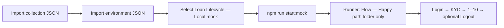

# Loan lifecycle API automation — complete guide

**JavaScript only** (Node **20+**): automated tests ([Vitest](https://vitest.dev/)), HTTP client, and a practice bank API with **Swagger UI**.

| If you are…                     | Jump to                                                                                                                                                                      |
| ------------------------------- | ---------------------------------------------------------------------------------------------------------------------------------------------------------------------------- |
| **QA / new to the repo**        | [Run tests (terminal & UI)](#2-run-tests), [API automation standards](#11-api-automation-standards-this-repo), [Practice API & Swagger](#3-practice-api--swagger)            |
| **Changing routes or payloads** | [Modify the project](#4-modify-the-project), [Update Swagger](#34-update-swagger-and-openapi)                                                                                |
| **PM / BA**                     | [Step-by-step lifecycle](#50-step-by-step-happy-path), [Production bank mapping §5.4](#54-mapping-to-production-bank-lifecycle), [Edge-case catalog](#53-edge-cases-catalog) |

---

## 1. Prerequisites & setup

1. **Node.js 20+** — [nodejs.org](https://nodejs.org/) or **nvm**: `nvm install 20` then `nvm use` (see **`.nvmrc`**).
2. Clone or copy this project folder.
3. One-time install:

```bash
cd "/path/to/API AUtomation Testing"
npm install
```

**Default test run** does **not** need a running server (it uses **MSW** to fake HTTP). Some tests need the practice API — see §2.2.

---

## 2. Run tests

### 2.1 Terminal — default (fast, no server)

```bash
npm test
```

Runs **MSW-backed** tests in memory; **integration** cases are **skipped** unless `LOAN_API_BASE_URL` is **`http://127.0.0.1:<port>/v1`** (any port; default mock **`8765`**) — see `javascript/lib/config.js` → `isLocalMockConfigured`. **`javascript/test/unit/`** is pure logic (catalog, eligibility, computation); **`javascript/test/integration/`** is Vitest + **MSW** against the HTTP client. Total test count grows over time (run **`npm test`** for the current tally).

**Watch mode** (re-run when files change):

```bash
npm run test:watch
```

### 2.2 Terminal — full suite (practice API + real HTTP)

**Terminal 1** — start the API:

```bash
npm run start:mock
```

**Terminal 2**:

```bash
export LOAN_API_BASE_URL=http://127.0.0.1:8765/v1
npm test
```

**Windows PowerShell:** `$env:LOAN_API_BASE_URL="http://127.0.0.1:8765/v1"; npm test`

You should see **all** tests pass (full **login → KYC → loan** behavior on the mock, plus catalogue/computation unit tests).

### 2.3 Vitest UI (browser dashboard)

Interactive UI to browse tests, re-run, and inspect results:

```bash
npm run test:ui
```

When it starts, open the URL shown in the terminal (often `http://localhost:51204/__vitest__/`).  
This is for **tests**, not for calling the loan API (use **Swagger** or **Postman** for that).

### 2.4 Understanding results

| Result      | Meaning                                                                                           |
| ----------- | ------------------------------------------------------------------------------------------------- |
| **Passed**  | Behavior matches assertions.                                                                      |
| **Failed**  | Note the **test name** (it describes the rule); fix code or update tests if requirements changed. |
| **Skipped** | Usually integration tests when `LOAN_API_BASE_URL` isn’t set to **`http://127.0.0.1:<port>/v1`**. |

### 2.5 Quality gate commands (local / CI)

| Command                    | Role                                                                                                                                                                                                 |
| -------------------------- | ---------------------------------------------------------------------------------------------------------------------------------------------------------------------------------------------------- |
| `npm run validate:openapi` | Confirms **`javascript/mock-server/openapi.json`** parses and **`$ref`**s resolve (contract discipline).                                                                                             |
| `npm run lint`             | **ESLint** on `javascript/` and `scripts/` (style + common bugs).                                                                                                                                    |
| `npm run format:check`     | **Prettier** check on JS sources (no drift without `npm run format`).                                                                                                                                |
| `npm run test:coverage`    | Vitest + **coverage** with **thresholds** on `loanApiClient`, `config`, `sampleData`, `loanConstants` (the automation-facing surface).                                                               |
| `npm run test:integration` | Starts **`start:mock`** on **port 9876** (avoids clashing with a dev server on **8765**), waits for **`/openapi.json`**, runs **full** Vitest with **`LOAN_API_BASE_URL=http://127.0.0.1:9876/v1`**. |
| `npm run ci`               | OpenAPI → lint → format → coverage → integration — matches **GitHub Actions** workflow.                                                                                                              |

Node **20+** is required (see **`.nvmrc`**); CI uses **ubuntu-latest** + **Node 20**.

---

## 3. Practice API & Swagger

### 3.1 Start the server

```bash
npm run start:mock
```

Default: **http://127.0.0.1:8765** (`PORT` and `HOST` env vars optional).

### 3.2 Try in the browser

| What                                | URL                                                                                                                                                                                                            |
| ----------------------------------- | -------------------------------------------------------------------------------------------------------------------------------------------------------------------------------------------------------------- |
| **Swagger UI** (“Try it out”)       | [http://127.0.0.1:8765/docs](http://127.0.0.1:8765/docs) — **Reference** tag has **health**, **loan-products**, **loan-computation-preview** (no auth); then **POST /auth/login** + **Authorize** for the rest |
| **OpenAPI JSON** (machine-readable) | [http://127.0.0.1:8765/openapi.json](http://127.0.0.1:8765/openapi.json) — same contract Swagger renders (`info.version` tracks releases)                                                                      |
| **Root**                            | Redirects to `/docs`                                                                                                                                                                                           |

**Postman:** import **`postman/collection/Loan_Lifecycle_API.postman_collection.json`** and **`postman/environments/Local_Mock.postman_environment.json`** (select that environment); full steps are in [§7 Postman](#7-postman).

### 3.3 Port already in use (`EADDRINUSE`)

Another process (or an old server) is using **8765**. Either:

```bash
lsof -ti tcp:8765 | xargs kill   # macOS / Linux
```

Or run on another port:

```bash
PORT=8766 npm run start:mock
```

If you use a non-default port, set `LOAN_API_BASE_URL` to that port on **`127.0.0.1`** (integration tests match any loopback port; **8765** is only the default in **`npm run start:mock`**).

### 3.4 Update Swagger and OpenAPI

Swagger is driven by **`javascript/mock-server/openapi.json`** (served as `/openapi.json`). Keep it in sync when the API changes.

1. **Change behavior** — edit **`javascript/mock-server/server.js`** (routes, validation, responses).
2. **Change the contract docs** — edit **`javascript/mock-server/openapi.json`**:
   - **`paths`** — add or adjust URL templates (`/v1/...`), methods, `requestBody`, `responses`, examples.
   - **`components.schemas`** — reuse field shapes; add new schemas for new bodies.
3. **Restart** — `npm run start:mock` and hard-refresh **`/docs`** in the browser.
4. **Keep clients aligned** — update **`javascript/lib/loanApiClient.js`**, **`javascript/test/**/\*.test.js`** (and **MSW** handler URLs/bodies), and **Postman\*\* if paths or JSON differ.

**Tip:** Valid JSON is required. Validate with:

```bash
node -e "JSON.parse(require('fs').readFileSync('javascript/mock-server/openapi.json','utf8')); console.log('OK')"
```

---

## 4. Modify the project

| Goal                           | Files                                                                                                                      |
| ------------------------------ | -------------------------------------------------------------------------------------------------------------------------- |
| **Paths / HTTP methods**       | `javascript/lib/loanApiClient.js`, `javascript/mock-server/server.js`, `javascript/mock-server/openapi.json`, Postman JSON |
| **Sample data**                | `javascript/lib/sampleData.js`                                                                                             |
| **Fake responses (no server)** | MSW handlers in `javascript/test/integration/loanLifecycle.test.js`, `javascript/test/integration/loanEdgeCases.test.js`   |
| **When integration tests run** | `javascript/lib/config.js` (`isLocalMockConfigured`, env vars)                                                             |
| **Env / secrets**              | `.env` (not committed), `LOAN_API_BASE_URL`, `LOAN_API_KEY`                                                                |

**Real staging API:** set `LOAN_API_BASE_URL` (and optional `LOAN_API_KEY`) before `npm test`. Paths must match `loanApiClient.js`.

---

## 5. Loan lifecycle (business view)

**Origination + servicing** in a single, teachable API. The **order of steps and the language** (KYC → intake → **ops / processing** → **initial disclosures** → credit → **underwriting queue** → decision → clear-to-close → **funding authorization** → **book / fund** → **disburse** → **pay** → **close**) mirrors common **LOS** and **funding-desk** handoffs — still a **sandbox**, but closer to how teams describe production. See §5.4 for a **production mapping** and honest limits.

### 5.0 Step-by-step happy path

Follow this order in **Swagger**, **Postman**, or your app. **Almost every** `/v1` call requires a **`Bearer` token** from **login**; **create application** also requires completed **KYC**. **Before login**, you can call **`GET /v1/health`**, **`GET /v1/reference/loan-products`** (PHP **Personal Loan** catalogue), and **`GET /v1/reference/loan-computation-preview`** (add-on interest, fees, net proceeds, EIR) — all **public** (no Bearer).

| #                             | What happens (plain English)                             | API call                                                                                                                   | Body / notes                                                                                                                                                                                                                                                                                                                                                                                                                                                                                                                                                                                                                                                                                                                                                            | You need                                                                 | You get / save                                                                   |
| ----------------------------- | -------------------------------------------------------- | -------------------------------------------------------------------------------------------------------------------------- | ----------------------------------------------------------------------------------------------------------------------------------------------------------------------------------------------------------------------------------------------------------------------------------------------------------------------------------------------------------------------------------------------------------------------------------------------------------------------------------------------------------------------------------------------------------------------------------------------------------------------------------------------------------------------------------------------------------------------------------------------------------------------- | ------------------------------------------------------------------------ | -------------------------------------------------------------------------------- |
| **—**                         | **Log in** (session).                                    | `POST /v1/auth/login`                                                                                                      | **Public** — no `Authorization` header. JSON: **`email`**, **`password`**. Sandbox accepts **`demo`** or **`demo123`**.                                                                                                                                                                                                                                                                                                                                                                                                                                                                                                                                                                                                                                                 | —                                                                        | **`access_token`** — send as `Authorization: Bearer <token>` on all later steps. |
| **—**                         | **Customer KYC** (onboarding).                           | `POST /v1/onboarding/kyc`                                                                                                  | **`full_name`**, **`email`**, **`date_of_birth`** (YYYY-MM-DD), **`national_id_last4`** (4 digits).                                                                                                                                                                                                                                                                                                                                                                                                                                                                                                                                                                                                                                                                     | Bearer                                                                   | **`VERIFIED`** (simulated). **403** on create loan if skipped.                   |
| **1**                         | Start a new application (draft).                         | `POST /v1/loan-applications`                                                                                               | Full **Metrobank-style** intake: **`loan_purpose`**, **`additional_information`** (PEP booleans), **`borrower`** (names or **`full_name`**, consents, **Step 3** ID subset, **11-digit** ID number, PH **mobile**, gender / marital / education / place of birth, **Present Home Address** + optional **home_phone**), **`employment`** (**employer_address** when **EMPLOYED**, optional **business_mobile_phone** / **business_phone**, **source_of_funds**, **employment_status**, catalogue **occupation**, **industry**, **business_email**, tenure, **gross_monthly_income_cents** (×12 ≥ catalogue **min_annual_income_cents**, PHP **250,000**/year min). Principal = **whole PHP** (centavos **÷ 100**). Eligibility must pass (**422** if not). See **§5.2**. | Bearer + KYC done                                                        | **`application_id`** ← response **`id`**. **`loan_id` is `null`** (normal).      |
| **1a** _(optional)_           | Check eligibility only (review screen **Next**).         | `POST /v1/loan-applications/eligibility-preview`                                                                           | Same JSON as create; **no** draft persisted.                                                                                                                                                                                                                                                                                                                                                                                                                                                                                                                                                                                                                                                                                                                            | Bearer + KYC                                                             | **`eligible`**, **`checks`**, **`failed_checks`**.                               |
| **1b** _(optional)_           | Fix **DRAFT** after review (**Edit** / back).            | `PATCH /v1/loan-applications/{applicationId}`                                                                              | Partial merge of amount / term / **borrower** / **employment** / prerequisite; re-validates. Changing **borrower.primary_id_document_type** clears prior document registration.                                                                                                                                                                                                                                                                                                                                                                                                                                                                                                                                                                                         | Bearer + **application_id** (**DRAFT**, same session)                    | Updated **DRAFT**.                                                               |
| **1c**                        | Confirm document upload ID (**Step 7**).                 | `POST /v1/loan-applications/{applicationId}/documents`                                                                     | **`primary_id_document_type`** must equal **borrower.primary_id_document_type** (**422** if not).                                                                                                                                                                                                                                                                                                                                                                                                                                                                                                                                                                                                                                                                       | Bearer + **application_id** (**DRAFT**)                                  | **`document_intake`** set — required before **submit**.                          |
| **2**                         | Send the application to processing.                      | `POST /v1/loan-applications/{applicationId}/submit`                                                                        | No body. **Personal Loan:** document step **1c** must be done first (**409** if skipped).                                                                                                                                                                                                                                                                                                                                                                                                                                                                                                                                                                                                                                                                               | **application_id** from step 1                                           | Status **SUBMITTED**.                                                            |
| **3**                         | Ops / processing accepts the file (LOS queue).           | `POST /v1/loan-applications/{applicationId}/processing/accept`                                                             | No body.                                                                                                                                                                                                                                                                                                                                                                                                                                                                                                                                                                                                                                                                                                                                                                | **application_id**                                                       | Status **IN_PROCESSING**.                                                        |
| **4**                         | Initial disclosures acknowledged (sandbox gate).         | `POST /v1/loan-applications/{applicationId}/disclosures/acknowledge`                                                       | Optional: `{ "package_version": "…" }` (ignored by validation).                                                                                                                                                                                                                                                                                                                                                                                                                                                                                                                                                                                                                                                                                                         | **application_id**                                                       | **`disclosures_acknowledged_at`** set — required before credit.                  |
| **5**                         | Run credit (sandbox pass/fail).                          | `POST /v1/loan-applications/{applicationId}/credit-check`                                                                  | e.g. `{ "force_outcome": "PASS" }` for demos.                                                                                                                                                                                                                                                                                                                                                                                                                                                                                                                                                                                                                                                                                                                           | **application_id**                                                       | **CREDIT_COMPLETED** (or **DECLINED** — **stop**).                               |
| **6**                         | Underwriting queue (file with underwriter).              | `POST /v1/loan-applications/{applicationId}/underwriting/start`                                                            | No body.                                                                                                                                                                                                                                                                                                                                                                                                                                                                                                                                                                                                                                                                                                                                                                | **application_id**                                                       | Status **IN_UNDERWRITING**.                                                      |
| **7**                         | Underwriter approves (or adds conditions).               | `POST /v1/loan-applications/{applicationId}/underwriting/decision`                                                         | e.g. `{ "outcome": "APPROVE" }` OR conditional with **stipulations** array.                                                                                                                                                                                                                                                                                                                                                                                                                                                                                                                                                                                                                                                                                             | **application_id**                                                       | **`loan_id`** ← **`loan.id`**. If **DECLINE**, **`loan`** is null — stop.        |
| **8** _(only if conditional)_ | Clear stips — **all at once** or **one UUID at a time**. | `POST /v1/loan-applications/{applicationId}/stipulations/fulfill-all` **or** `POST …/stipulations/{stipulationId}/fulfill` | **fulfill-all:** no body; response has **`fulfilled_stipulation_ids`**.                                                                                                                                                                                                                                                                                                                                                                                                                                                                                                                                                                                                                                                                                                 | **application_id**; per-stip needs each **`stipulation.id`** from step 7 | Application **APPROVED_CLEAR_TO_CLOSE**, loan **PENDING_FUNDING**.               |
| **9**                         | Funding desk clears loan to book (secondary approval).   | `POST /v1/loans/{loanId}/funding/authorize`                                                                                | No body.                                                                                                                                                                                                                                                                                                                                                                                                                                                                                                                                                                                                                                                                                                                                                                | **loan_id**                                                              | Loan **CLEARED_FOR_BOOKING**; **`funding_authorized_at`** set.                   |
| **10**                        | Book the loan on the bank’s books (“fund”).              | `POST /v1/loans/{loanId}/fund`                                                                                             | No body. Only after **authorize**.                                                                                                                                                                                                                                                                                                                                                                                                                                                                                                                                                                                                                                                                                                                                      | **loan_id**                                                              | Loan **FUNDED**; **`funded_at`** set (proceeds **not** sent yet).                |
| **11**                        | Pay the borrower (“disburse”).                           | `POST /v1/loans/{loanId}/disburse`                                                                                         | No body. Only after **fund**.                                                                                                                                                                                                                                                                                                                                                                                                                                                                                                                                                                                                                                                                                                                                           | **loan_id**                                                              | Loan **ACTIVE**; **`disbursed_at`**.                                             |
| **12** _(optional)_           | Preview payment dates.                                   | `GET /v1/loans/{loanId}/payment-schedule`                                                                                  | —                                                                                                                                                                                                                                                                                                                                                                                                                                                                                                                                                                                                                                                                                                                                                                       | **loan_id**                                                              | Demo schedule JSON.                                                              |
| **13**                        | Customer pays down balance.                              | `POST /v1/loans/{loanId}/payments`                                                                                         | `{ "amount_cents": N, "method": "ACH" }`                                                                                                                                                                                                                                                                                                                                                                                                                                                                                                                                                                                                                                                                                                                                | **loan_id**                                                              | Balance drops; **PAID_OFF** if balance hits 0.                                   |
| **14**                        | Close the loan on the system.                            | `POST /v1/loans/{loanId}/payoff`                                                                                           | No body.                                                                                                                                                                                                                                                                                                                                                                                                                                                                                                                                                                                                                                                                                                                                                                | **loan_id**                                                              | Status **CLOSED**.                                                               |
| **—**                         | **Log out** (invalidate token).                          | `POST /v1/auth/logout`                                                                                                     | No body.                                                                                                                                                                                                                                                                                                                                                                                                                                                                                                                                                                                                                                                                                                                                                                | Bearer                                                                   | **204** — reuse requires **login** again.                                        |

**Remember:** **`loan_id` does not exist until step 7** (underwriting decision) creates the loan. Until then only **`application_id`** matters. Helpers in **`javascript/test/integration/flowHelpers.js`** (`throughCredit`, `throughUnderwritingDecision`, `activeLoan`) chain these steps for **Vitest**; **`LoanApiClient`** exposes each **POST** separately for Postman and app code.

**HTTP:** Every **`/v1/...`** call except **`POST /auth/login`**, **`GET /health`**, **`GET /reference/loan-products`**, and **`GET /reference/loan-computation-preview`** must send **`Authorization: Bearer`** with the **`access_token`** from login (Postman and **`LoanApiClient.setAccessToken`** handle this).

**Who am I?** Optional: `GET /v1/auth/me` or `GET /v1/onboarding/status` with Bearer — shows user + whether KYC is complete.

#### When your real product differs — what to update (checklist)

Use the same list whenever you change URLs, fields, or rules so **docs**, **tests**, and **mocks** stay aligned.

| If you change…                                                  | Update these (minimum)                                                                                                                                                       |
| --------------------------------------------------------------- | ---------------------------------------------------------------------------------------------------------------------------------------------------------------------------- |
| **Path** (e.g. `/applications` instead of `/loan-applications`) | `javascript/lib/loanApiClient.js`, `javascript/mock-server/server.js`, `javascript/mock-server/openapi.json`, Postman collection, MSW URLs in `javascript/test/**/*.test.js` |
| **Request JSON** (field names, types, money format)             | `server.js` validation + handlers, `openapi.json` schemas/examples, `sampleData.js`, tests’ payloads, Postman bodies                                                         |
| **Response JSON** or **status values**                          | `openapi.json`, assertions in `javascript/test/**/*.test.js`, MSW mock JSON in same files                                                                                    |
| **State machine** (when submit/credit/fund is allowed)          | `server.js` guards (`409` logic), edge-case tests, [§5.3 Edge cases catalog](#53-edge-cases-catalog)                                                                         |
| **New step** in the journey                                     | Add route in `server.js`, document path in `openapi.json`, add `loanApiClient` method, add/extend tests + Postman folder                                                     |
| **Port or base URL** for local integration                      | `LOAN_API_BASE_URL` (`127.0.0.1` + `/v1`), Postman **`base_url`**                                                                                                            |
| **Auth** (headers, tokens)                                      | `loanApiClient.js`, Postman auth, optional checks in `server.js`                                                                                                             |

---

### 5.1 Route cheat sheet (one line per step)

| Step | Meaning                  | Example API (`/v1/...`)                                                                                                                                                   |
| ---- | ------------------------ | ------------------------------------------------------------------------------------------------------------------------------------------------------------------------- |
| —    | Health (liveness)        | `GET /health` — **public**                                                                                                                                                |
| —    | Product catalogue        | `GET /reference/loan-products` — **public** (**PHP Personal Loan** JSON)                                                                                                  |
| —    | Payment / EIR preview    | `GET /reference/loan-computation-preview?principal_cents=&term_months=` — **public** (see **`javascript/lib/personalLoanComputation.js`**)                                |
| —    | Login                    | `POST /auth/login` → **access_token**                                                                                                                                     |
| —    | KYC                      | `POST /onboarding/kyc` → **VERIFIED**                                                                                                                                     |
| —    | Optional profile         | `GET /auth/me`, `GET /onboarding/status`                                                                                                                                  |
| 1    | Application draft        | `POST /loan-applications` → **DRAFT** (catalogue + **eligibility** gates; then **1c** document ID confirmation before **submit**)                                         |
| 1a   | Eligibility preview      | `POST /loan-applications/eligibility-preview` — same body as create; no persistence (**Step 6** **Next**)                                                                 |
| 1b   | Update draft             | `PATCH /loan-applications/{applicationId}` — **DRAFT** only; merge fields                                                                                                 |
| 1c   | Document upload (ID)     | `POST /loan-applications/{applicationId}/documents` — **primary_id_document_type** must match **borrower.primary_id_document_type**                                       |
| 1d   | Preview from application | `GET /loan-applications/{applicationId}/computation-preview` — **Bearer**; uses **principal_cents** / **term_months** from that application (same math as public preview) |
| 2    | Submit                   | `POST .../submit` → **SUBMITTED**                                                                                                                                         |
| 3    | Ops accept               | `POST .../processing/accept` → **IN_PROCESSING**                                                                                                                          |
| 4    | Disclosures              | `POST .../disclosures/acknowledge`                                                                                                                                        |
| 5    | Credit                   | `POST .../credit-check` → **CREDIT_COMPLETED** or **DECLINED**                                                                                                            |
| 6    | Start underwriting       | `POST .../underwriting/start` → **IN_UNDERWRITING**                                                                                                                       |
| 7    | Underwriting decision    | `POST .../underwriting/decision` → may create **loan**                                                                                                                    |
| 8    | Clear stips (if any)     | `POST .../stipulations/fulfill-all` or `POST .../stipulations/{id}/fulfill`                                                                                               |
| 9    | Funding authorize        | `POST /loans/{id}/funding/authorize` → **CLEARED_FOR_BOOKING**                                                                                                            |
| 10   | Fund (book)              | `POST /loans/{id}/fund` → **FUNDED**                                                                                                                                      |
| 11   | Disburse (pay borrower)  | `POST /loans/{id}/disburse` → **ACTIVE**                                                                                                                                  |
| 12   | Schedule preview         | `GET /loans/{id}/payment-schedule`                                                                                                                                        |
| 13   | Payment                  | `POST /loans/{id}/payments`                                                                                                                                               |
| 14   | Payoff / close           | `POST /loans/{id}/payoff` → **CLOSED**                                                                                                                                    |
| —    | Logout                   | `POST /auth/logout` → **204**                                                                                                                                             |

**Application statuses:** `DRAFT` → `SUBMITTED` → `IN_PROCESSING` → (disclosures) → `CREDIT_COMPLETED` → `IN_UNDERWRITING` → `APPROVED_*` / `DECLINED` (and conditional states in between).

**Loan statuses:** `PENDING_STIPS` → `PENDING_FUNDING` → `CLEARED_FOR_BOOKING` → `FUNDED` → `ACTIVE` → `PAID_OFF` → `CLOSED`.

### 5.2 Product catalogue (terms) & payment rails (mock LOVs)

The mock ships a single origination product: **`PERSONAL_LOAN`** (**PHP** only). Catalogue copy, rates, fees, and eligibility text live in **`javascript/lib/loanProductCatalog.js`**. **`GET /v1/reference/loan-products`** returns that JSON for UIs and tests.

**Wizard (personal loan):** **`intake_flow`** on the product describes UI steps **1–7** (prerequisite through document upload). Steps **1–6** map to API fields on **`POST /loan-applications`** (and **`eligibility-preview`**). Step **6** (**Additional information**) is the review screen; **`POST …/eligibility-preview`** mirrors **Next** before persisting. **`PATCH …/loan-applications/{id}`** supports edits on a **DRAFT** after review.

**Metrobank intake (personal loan):** The catalogue includes **`metrobank_client_prerequisite`** — the first question is effectively **“Are you an existing Metrobank Client?”** with three answers: **Metrobank client with credit card**, **Metrobank client with deposit account**, or **not yet a Metrobank client**. Only the first two may proceed; **`NOT_METROBANK_CLIENT`** is rejected on **create application** (**422**) because servicing assumes a Metrobank channel for proceeds/repayments. Eligibility evaluation (**`javascript/lib/personalLoanEligibility.js`**) enforces the published **eligibility** bullets (citizenship, ages, income, relationship, employment tenure).

**Primary government ID (Step 3 vs upload):** Step **3** (“Choose an ID” in basic details) uses a **six-option subset** only: **`GET /v1/reference/loan-products`** → **`step3_primary_id_document_types`** (GSIS, SSS, TIN, Driver’s License, Passport, UMID). **POST /loan-applications** rejects other codes (**422**); **`PATCH`** on a **DRAFT** may set **`borrower.primary_id_document_type`** to **any** value from the **full** LOV (**`primary_id_document_types`** — e.g. PRC, Company ID, …) so the borrower can change ID type before Step 7. Step **7** upload uses the **full** list; **`POST …/documents`** must still **match** the **current** **`borrower.primary_id_document_type`** (**422** on mismatch). If **`PATCH`** changes the ID after documents were registered, **`document_intake`** is cleared until **`POST …/documents`** runs again.

**Present Home Address (mock):** **`borrower.residential_address`** supports the Metrobank-style **No./Blk./St.** through **ZIP** using **`GET /reference/loan-products`** → **`philippine_address_sample_rows`**. The legacy shape (**`line1`**, **`city`**, **`province_region`**, **`postal_code`**) remains valid when **`street_line`** is omitted. **Employer Address** is **`employment.employer_address`** (optional **Subdivision/Building** via **`subdivision_building`**) — same PH row rules when **`employment.status`** is **EMPLOYED**. Optional **`employment.business_mobile_phone`** and **`employment.business_phone`** (landline **area_code** from **`landline_area_code_options`** + **subscriber_number** — same shape as **`borrower.home_phone`**).

#### 5.2.1 Personal Loan — prerequisite & field map (existing Metrobank client, credit card path)

The **same** intake fields and create body apply when the borrower is an **existing Metrobank client with a deposit account**; only **`metrobank_client_type`** differs from the credit-card path at Step 1.

**Step 1 — Pre-requisite (“Are you an existing Metrobank Client?”)** → **`metrobank_client_type`** on **POST /loan-applications**: **Yes — credit card** = **`EXISTING_CLIENT_CREDIT_CARD`**; **Yes — deposit account** = **`EXISTING_CLIENT_DEPOSIT_ACCOUNT`**; **Not yet a Metrobank client** = **`NOT_METROBANK_CLIENT`** (rejected **422**). Details in **`metrobank_client_prerequisite`** on **GET /reference/loan-products**.

**Step 2 — Loan application details**

| UI label         | JSON                  | Rules (this mock)                                                                                                                                                              |
| ---------------- | --------------------- | ------------------------------------------------------------------------------------------------------------------------------------------------------------------------------ |
| **Loan Amount**  | **`principal_cents`** | Integer **PHP centavos**; whole pesos only (**multiple of 100**); **not** zero; **PHP 20,000**–**2,000,000**.                                                                  |
| **Loan Purpose** | **`loan_purpose`**    | Required; dropdown — Appliance/Gadgets, Business, Car Repair, Debt Consolidation, Home Repair, Medical Emergency, Personal Consumption, Travel, Wedding (**`loan_purposes`**). |
| **Loan Term**    | **`term_months`**     | Required; **12**, **18**, **24**, or **36** (UI labels e.g. **12 months** … **36 months**).                                                                                    |

**Computation (system output, no intake inputs):** **GET /v1/reference/loan-computation-preview** (public) or **GET /v1/loan-applications/{applicationId}/computation-preview** (Bearer) returns **loan amount**, **monthly add-on interest rate** (from the chosen term), **effective interest rate (EIR)**, **monthly amortization**, **total interest**, **total fees and charges** (disbursement fee + documentary stamp tax where applicable), and **net loan proceeds**. Implemented in **`javascript/lib/personalLoanComputation.js`**.

**Step 3 — Basic details**

| UI label              | JSON                                                | Rules (this mock)                                                                                                                                                 |
| --------------------- | --------------------------------------------------- | ----------------------------------------------------------------------------------------------------------------------------------------------------------------- |
| **First / Last Name** | **`borrower.first_name`**, **`borrower.last_name`** | Text: letters and spaces only, single spaces between words, **no** leading/trailing spaces, **1–30** chars each; required unless legacy **`borrower.full_name`**. |
| **Middle Name**       | **`borrower.middle_name`**                          | Optional; when sent, same text rules, **1–30** chars.                                                                                                             |
| **Email Address**     | **`borrower.email`**                                | Required; valid email.                                                                                                                                            |
| **Mobile Number**     | **`borrower.mobile_phone`**                         | Required; Philippine mobile — national first digit **9**; **+639…**, **09…**, or **9XXXXXXXXX** forms accepted.                                                   |
| **Date of Birth**     | **`borrower.date_of_birth`**                        | **YYYY-MM-DD**; must be **strictly before today** (valid past DOB; eligibility also enforces age bands).                                                          |
| **Choose an ID**      | **`borrower.primary_id_document_type`**             | On **POST**, Step **3** subset only: GSIS, SSS, TIN, Driver’s License, Passport, UMID.                                                                            |
| **ID Number**         | **`borrower.primary_id_document_number`**           | Required; **11** digits (fixed-width teaching rule).                                                                                                              |
| **Consents**          | **`borrower.consents`**                             | Required; all three **`true`**: Terms of Use, Terms and Conditions, Data Privacy Policy.                                                                          |

**Step 4 — Present Home Address & other information** — **`borrower.residential_address`**: **No./Blk./St.** (**`street_line`**, required in new shape); **Subdivision/Village** (**`subdivision_village`**, optional); **Province** / **City/Town** / **Barangay** / **ZIP** (**`province`, `city_town`, `barangay`, `postal_code`**) — dependent LOVs, ZIP must match the selected triplet (**`philippine_address_sample_rows`**); **Home Ownership** optional (**`home_ownership`** — Living with Parents/Relatives, Mortgage, Other — Company Provided, Owned, Rented). **`borrower.home_phone`** optional: **area_code** (**landline_area_code_options** — **002**–**088** and **0882**) + **subscriber_number** (8 digits); both required if either is sent. **Gender**, **Marital Status**, **Education**, **Citizenship**, **Place of Birth** — **`gender_options`**, **`marital_status_options`**, **`education_options`**, **`citizenship`**, **`place_of_birth`** (catalogue labels match the form, e.g. **Marriage**, **College/Graduate**, **Technical/Vocational Schools**).

**Step 5 — Employment details** — **`employment`**: **Source of funds** (**`source_of_funds`**); **Employment status** (**`employment_status`**); **Occupation** (**`occupation`** — **`occupations[].value`**). When **EMPLOYED**: **`employer_name`**, **`employer_address`** (No./Blk./St. **`street_line`**, optional **Subdivision/Building** **`subdivision_building`**, **Province / City/Town / Barangay / ZIP** — same **`philippine_address_sample_rows`** as home), **`years_with_current_employer`**, **`is_regular_employment`**. Optional **`business_mobile_phone`** (PH mobile), **`business_phone`** (same **landline_area_code_options** + **subscriber_number** as **home_phone**). When **SELF_EMPLOYED**: **`business_name`**, **`years_in_current_business`** (no **`employer_address`** required). **Industry**, **`business_email`**, **`years_working_total`**, **`gross_monthly_income_cents`**; **`status`** aligns with **`source_of_funds`**.

**Step 6 — Additional information** — **`additional_information`**: both PEP-related booleans mandatory (**Yes/No**; API booleans; UI default **No**): close relationship with prominent public / international role; substantial financial transactions on behalf of such a person.

**Step 7 — Upload documents** — **POST …/documents**: selected ID must match **`borrower.primary_id_document_type`** (if the borrower **PATCH**es the ID after Step 3, upload must follow the **new** type — mismatch → **422**). Full upload LOV: GSIS, SSS, TIN, Driver’s License, Passport, UMID, PRC, Company ID, EO226, Visa, Work Permit, Postal, Senior, Voters, Others (**`primary_id_document_types`**).

| Field                                       | Allowed values / rules                                                                               | Notes                                                                                                                                                                                                                                                                                                                                                                                                                                                                               |
| ------------------------------------------- | ---------------------------------------------------------------------------------------------------- | ----------------------------------------------------------------------------------------------------------------------------------------------------------------------------------------------------------------------------------------------------------------------------------------------------------------------------------------------------------------------------------------------------------------------------------------------------------------------------------- |
| **`product_code`** (on create application)  | **`PERSONAL_LOAN`**                                                                                  | Unknown codes → **422**.                                                                                                                                                                                                                                                                                                                                                                                                                                                            |
| **`metrobank_client_type`**                 | **`EXISTING_CLIENT_CREDIT_CARD`**, **`EXISTING_CLIENT_DEPOSIT_ACCOUNT`**, **`NOT_METROBANK_CLIENT`** | Required on create. Eligible values: **credit card** or **deposit account** only. **`NOT_METROBANK_CLIENT`** → **422**. See **`metrobank_client_prerequisite`** on **GET /reference/loan-products**.                                                                                                                                                                                                                                                                                |
| **`loan_purpose`**                          | **`LoanPurpose`** enum                                                                               | **Loan Purpose** — Appliance/Gadgets, Business, Car Repair, Debt Consolidation, Home Repair, Medical Emergency, Personal Consumption, Travel, Wedding — **`loan_purposes`**.                                                                                                                                                                                                                                                                                                        |
| **`term_months`**                           | **12, 18, 24, 36**                                                                                   | **Loan Term** — UI “**12 / 18 / 24 / 36** months”; must match **`term_options`**.                                                                                                                                                                                                                                                                                                                                                                                                   |
| **`additional_information`**                | Two **boolean** fields                                                                               | Step **6** PEP questions — **`pep_close_family_or_public_position`**, **`pep_financial_transactions_on_behalf`** — both required (UI default **No** / **false**).                                                                                                                                                                                                                                                                                                                   |
| **`borrower.first_name`** / **`last_name`** | **1–30** chars, letters/spaces                                                                       | **First / Last Name** — no digits or special characters; single spaces between words; **no** leading/trailing spaces; or legacy **`full_name`**.                                                                                                                                                                                                                                                                                                                                    |
| **`borrower.consents`**                     | All **`true`**                                                                                       | **Terms of Use**, **Terms and Conditions**, **Data Privacy Policy** — must each be **`true`** on create/PATCH merge.                                                                                                                                                                                                                                                                                                                                                                |
| **`borrower.email`**                        | Email                                                                                                | **Email Address** — required; valid format.                                                                                                                                                                                                                                                                                                                                                                                                                                         |
| **`borrower.date_of_birth`**                | **YYYY-MM-DD**                                                                                       | **Date of Birth** — strictly **before** today (past date).                                                                                                                                                                                                                                                                                                                                                                                                                          |
| **`borrower.middle_name`**                  | Optional                                                                                             | **Middle Name** — when present: **1–30** chars, letters and spaces only (no digits or special characters), interior spaces allowed; **no** leading or trailing spaces.                                                                                                                                                                                                                                                                                                              |
| **`borrower.gender`**                       | **FEMALE**, **MALE**, **UNKNOWN**                                                                    | **Gender** — Female, Male, Unknown — **`gender_options`**.                                                                                                                                                                                                                                                                                                                                                                                                                          |
| **`borrower.marital_status`**               | Catalogue enum                                                                                       | **Marital Status** — Divorced or Separated, Marriage, Single, Widowed, Unknown — **`marital_status_options`**.                                                                                                                                                                                                                                                                                                                                                                      |
| **`borrower.education`**                    | Catalogue enum                                                                                       | **Education** — College/Graduate, Grade School, High School, Limited/None, Postgraduate, Technical/Vocational Schools — **`education_options`** (dropdown + search in production).                                                                                                                                                                                                                                                                                                  |
| **`borrower.citizenship`**                  | **`FILIPINO`** (sandbox)                                                                             | **Citizenship** — dropdown + search in production; mock accepts **FILIPINO** only.                                                                                                                                                                                                                                                                                                                                                                                                  |
| **`borrower.place_of_birth`**               | **3–30** chars, letters/spaces                                                                       | **Place of Birth** — no digits or special characters; **no** leading/trailing spaces.                                                                                                                                                                                                                                                                                                                                                                                               |
| **`borrower.residential_address`**          | **Present Home Address**                                                                             | **street_line** (No./Blk./St.), optional **subdivision_village**, **province**, **city_town**, **barangay**, **postal_code** (ZIP), optional **home_ownership**. Quad + ZIP must match **GET /reference/loan-products** → **philippine_address_sample_rows**. Legacy **line1** / **city** / **province_region** if **street_line** omitted.                                                                                                                                         |
| **`borrower.home_phone`**                   | Optional                                                                                             | **area_code** from **GET /reference/loan-products** → **landline_area_code_options** (**002**–**088** and **0882**) + **subscriber_number** (8 digits).                                                                                                                                                                                                                                                                                                                             |
| **`borrower.primary_id_document_type`**     | **Step 3** subset on **POST**; full LOV on **PATCH**                                                 | **`step3_primary_id_document_types`** vs **`primary_id_document_types`** — see paragraph above. Must match **`POST …/documents`**.                                                                                                                                                                                                                                                                                                                                                  |
| **`borrower.primary_id_document_number`**   | **11 digits**                                                                                        | Numeric string; real formats vary — teaching sandbox uses fixed width.                                                                                                                                                                                                                                                                                                                                                                                                              |
| **`borrower.mobile_phone`**                 | PH mobile                                                                                            | National digit **9** — **+639…**, **09…**, or **9…** forms accepted.                                                                                                                                                                                                                                                                                                                                                                                                                |
| **`employment`**                            | Employed / self-employed shapes                                                                      | **Gross Monthly Income** — **`gross_monthly_income_cents`** (×12 ≥ **`min_annual_income_cents`**, PHP **250,000**/year). **EMPLOYED**: **`employer_address`** + PH row validation; optional **`business_mobile_phone`**, **`business_phone`**. **SELF_EMPLOYED**: **`business_name`**, **`years_in_current_business`**. Plus **`source_of_funds`**, **`employment_status`**, **`occupation`**, **`industry`**, **`business_email`**, tenure; **`status`** vs **`source_of_funds`**. |
| **`principal_cents`**                       | **PHP centavos**                                                                                     | **Loan Amount** — **min** PHP **20,000**, **max** PHP **2,000,000**; must be **integer multiple of 100** (whole pesos); **> 0**.                                                                                                                                                                                                                                                                                                                                                    |
| **`method`** (on record payment)            | **ACH**, **WIRE**                                                                                    | **ACH** — NACHA-style retail ACH; **WIRE** — domestic wire. Default **ACH** if omitted.                                                                                                                                                                                                                                                                                                                                                                                             |

**Payment preview (calculator):** **`GET /v1/reference/loan-computation-preview`** with query **`principal_cents`** and **`term_months`** returns total interest (add-on model), monthly amortization (nearest centavo), disbursement + DST, net proceeds, and effective annual **EIR** (%). **After** the borrower creates an application, **`GET /v1/loan-applications/{applicationId}/computation-preview`** (Bearer required) returns the **same** payload using amounts from that application — response includes **`application_id`**. Implementation is in **`javascript/lib/personalLoanComputation.js`**. **`LoanApiClient.getLoanComputationPreview({ … })`** and **`getLoanComputationPreviewForApplication(id)`** wrap the two routes.

Term union for tooling is still re-exported from **`javascript/lib/loanConstants.js`** as **`ALLOWED_LOAN_TERM_MONTHS`** (derived from the catalogue).

#### Stipulation `description` text — full sandbox list (copy-paste)

For **`POST …/underwriting/decision`** with **`"outcome": "CONDITIONAL"`**, each stipulation is **`{ "description": "<your text>" }`**. This mock **does not** check descriptions against a bank catalogue — **any** text works. The list below is **only** so you can pick realistic demo strings without searching elsewhere.

The same strings are exported in code as **`STIPULATION_DESCRIPTION_EXAMPLES`** in **`javascript/lib/loanConstants.js`** (also re-exported from **`javascript/lib/sampleData.js`**). Use **`buildConditionalUnderwritingExample(n)`** in **`sampleData.js`** to build a body with the first **n** entries programmatically.

| Topic                     | Example `description` values (use in `stipulations[]`)                                                                                                                                                                                |
| ------------------------- | ------------------------------------------------------------------------------------------------------------------------------------------------------------------------------------------------------------------------------------- |
| **Income & employment**   | Proof of income (W-2); Most recent pay stub (last 30 days); Two most recent years federal tax returns; Employment verification letter; Year-to-date profit and loss (self-employed); Business bank statements (12 months)             |
| **Identity & credit**     | Government-issued photo ID; Proof of Social Security number; Proof of legal name change; Letter of explanation for credit inquiry; Bankruptcy discharge or dismissal papers                                                           |
| **Assets & funds**        | Two months complete bank statements (all pages); Gift letter and donor evidence of funds; Letter of explanation for large deposits                                                                                                    |
| **Property / collateral** | Executed purchase agreement or sales contract; Homeowners insurance binder or declarations page; Flood insurance declarations (if required); HOA contact information and dues statement; Preliminary title report or title commitment |
| **Disclosures**           | Signed Loan Estimate; Signed Closing Disclosure; Signed initial loan disclosure package; Electronic consent / eSign acknowledgment                                                                                                    |
| **Insurance**             | Collateral insurance binder; Vehicle insurance declarations (auto-secured)                                                                                                                                                            |
| **Legal / household**     | Divorce decree or separation agreement; Child support order or payment history; Current lease agreement (rental income); Power of attorney (if signing by representative); Trust documentation (if title held in trust)               |

**Three-stip example body** (same idea as **Postman** / **`buildConditionalUnderwritingExample(3)`**):

```json
{
  "outcome": "CONDITIONAL",
  "stipulations": [
    { "description": "Proof of income (W-2)" },
    { "description": "Signed Closing Disclosure" },
    { "description": "Homeowners insurance binder or declarations page" }
  ]
}
```

### 5.3 Edge cases catalog

Catalog columns reference **`javascript/test/integration/loanEdgeCases.test.js`** and Postman **Edge cases** where noted.

#### A. Not found

| Scenario                           | Typical code | Automated         |
| ---------------------------------- | ------------ | ----------------- |
| Unknown `application_id` on submit | `404`        | Yes + Postman EC1 |
| Unknown `loan_id`                  | `404`        | Yes + Postman EC4 |

#### B. Validation

| Scenario                                          | Typical code | Automated         |
| ------------------------------------------------- | ------------ | ----------------- |
| Bad create body (`principal_cents` invalid, etc.) | `422`        | Yes + Postman EC2 |
| Payment `amount_cents` invalid                    | `422`        | Yes               |

#### C. Wrong state

| Scenario                                                                                                                                                                                                                                                                                  | Typical code | Automated                                                                                        |
| ----------------------------------------------------------------------------------------------------------------------------------------------------------------------------------------------------------------------------------------------------------------------------------------- | ------------ | ------------------------------------------------------------------------------------------------ |
| Double submit, decision before **IN_UNDERWRITING**, credit before **IN_PROCESSING** or before disclosures, **fund** before **funding/authorize**, fund/disburse out of order or twice, pay before **ACTIVE** (including while **FUNDED**), pay after `PAID_OFF`, fund while stips pending | `409`        | Yes (+ Postman **EC5**, **EC6**; tests **credit before disclosures**, **fund before authorize**) |

#### G. Auth & onboarding

| Scenario                                                   | Typical code | Automated |
| ---------------------------------------------------------- | ------------ | --------- |
| Protected route without `Authorization: Bearer`            | `401`        | Yes       |
| **POST /loan-applications** after login but **before** KYC | `403`        | Yes       |
| Bad login password (not `demo` / `demo123`)                | `401`        | —         |

#### D. Balance rules

| Scenario                 | Typical code | Automated         |
| ------------------------ | ------------ | ----------------- |
| Overpay                  | `400`        | Yes + Postman EC3 |
| Pay to zero → `PAID_OFF` | `200`        | Yes               |

#### E. Idempotency

| Scenario                   | Automated  |
| -------------------------- | ---------- |
| Payoff again when `CLOSED` | Yes (mock) |

#### F. Product LOV violations

| Scenario                                                                         | Typical code | Automated |
| -------------------------------------------------------------------------------- | ------------ | --------- |
| **`product_code`** not **`PERSONAL_LOAN`** / unknown code                        | `422`        | Yes       |
| **`metrobank_client_type`** is **`NOT_METROBANK_CLIENT`** (or missing / invalid) | `422`        | Yes       |
| **`term_months`** not in **12, 18, 24, 36**                                      | `422`        | Yes       |
| Principal / income outside catalogue min/max                                     | `422`        | Yes       |
| Unsupported **`method`** on payment (not **ACH** / **WIRE**)                     | `422`        | Yes       |

#### H. Not in this sandbox

Auth hardening, rate limits, idempotency keys, concurrency, webhooks — **backlog** for production.

### 5.4 Mapping to production bank lifecycle

This section answers: **“How close is the mock to real life?”** — **close on story and vocabulary**, **thin on systems and compliance**.

#### Design intent (what we mirror on purpose)

| Real-world idea                     | In this mock                                                                                                                                              |
| ----------------------------------- | --------------------------------------------------------------------------------------------------------------------------------------------------------- |
| Identity before origination         | KYC gate on **`POST /loan-applications`** (403 if not verified).                                                                                          |
| Application vs loan                 | **`application_id`** through credit; **`loan_id`** only after underwriting creates the obligation.                                                        |
| Credit before human/policy decision | **`credit-check`** completes before **`underwriting/start`** and **`underwriting/decision`**.                                                             |
| Disclosures before bureau           | **`disclosures/acknowledge`** gated before **credit-check** (compressed **Reg-TILA-style** step).                                                         |
| Approve / conditional / decline     | Underwriting **outcomes**; **DECLINED** ends the application journey.                                                                                     |
| Conditions (“stips”)                | **CONDITIONAL** → **`PENDING_STIPS`**; fulfill → **APPROVED_CLEAR_TO_CLOSE** / **PENDING_FUNDING**.                                                       |
| Booking vs paying the borrower      | **`fund`** = obligation booked (**FUNDED**); **`disburse`** = proceeds to borrower (**ACTIVE**).                                                          |
| Servicing after disbursement        | **`payments`**, optional schedule preview, **`payoff`** → **CLOSED**.                                                                                     |
| Product / rail vocabulary           | Term months and **ACH** / **WIRE** match common **core / servicing** wording.                                                                             |
| Wrong-order protection              | **409** guards (e.g. credit before disclosures, decision before **IN_UNDERWRITING**, fund before **authorize**, disburse before fund, pay before active). |
| Ops + funding sub-steps             | **processing/accept**, **disclosures/acknowledge**, **underwriting/start**, **funding/authorize** compress multi-team handoffs.                           |

#### Phase map: production (typical) ↔ this API

How a **large bank** often chunks work — versus **which calls** implement the same _story_ here (details in [§5.0](#50-step-by-step-happy-path)).

| Phase (names vary by bank) | What production usually involves                                              | This sandbox (approximation)                                                        |
| -------------------------- | ----------------------------------------------------------------------------- | ----------------------------------------------------------------------------------- |
| **Onboarding / KYC–AML**   | CIP, KYC, AML, sanctions, fraud vendors, case management                      | **`POST /onboarding/kyc`** → instant **VERIFIED**                                   |
| **Intake / application**   | Disclosures, e-sign, product & pricing, sometimes pricing engine              | **`POST /loan-applications`** (draft)                                               |
| **Submit / processing**    | Queue, checklist, document requests, verifications                            | **`POST …/submit`** then **`POST …/processing/accept`** → **IN_PROCESSING**         |
| **Disclosures**            | Initial packages, e-consent                                                   | **`POST …/disclosures/acknowledge`** (before credit)                                |
| **Credit**                 | Bureau pull(s), scores, policy, exceptions                                    | **`POST …/credit-check`** (sandbox **PASS** / **FAIL**)                             |
| **Underwriting**           | Decision, conditions, capacity/collateral rules                               | **`POST …/underwriting/start`** then **`POST …/underwriting/decision`**             |
| **Pre-close / collateral** | Title, insurance, appraisal, closing disclosure — often many systems and days | **`stipulations/fulfill`** or **`fulfill-all`** (compressed into “clear stips”)     |
| **Booking / funding**      | Funding committee / secondary approval, then GL booking                       | **`POST /loans/{id}/funding/authorize`** → **`POST /loans/{id}/fund`** → **FUNDED** |
| **Disbursement**           | Wire / ACH / escrow; cut-off times; dual control                              | **`POST /loans/{id}/disburse`** → **ACTIVE**                                        |
| **Servicing**              | Amortization, payments, statements, payoffs, loss mitigation                  | **`GET …/payment-schedule`**, **`POST …/payments`**, **`POST …/payoff`**            |
| **Closed / charged-off**   | Final accounting; charge-off and recovery workflows                           | **`payoff`** → **CLOSED** only; **no** charge-off / bankruptcy path                 |

#### What real production adds (not in this repo)

Use this list when communicating scope to **risk**, **ops**, or **compliance**: the mock does **not** replace their systems.

- **Multiple systems** — LOS, core, general ledger, document prep, wire room, collections, data warehouse.
- **Regulatory and policy depth** — fair lending, adverse action, re-disclosure timing, HMDA/CRA nuances, licensing, retention.
- **Time and operations** — business days, rescission, investor delivery, exceptions queues, human approvals.
- **Money movement** — real settlement, returns, NSF, partial payments, modifications.
- **Scale** — concurrency, idempotency keys, webhooks, audits, SOC-style controls (see §5.3 **H. Not in this sandbox**).

**Summary:** Treat the lifecycle as **as close as reasonable for API automation practice** — same **narrative spine** many banks use — while remaining a **sandbox** for **tests, demos, and shared vocabulary**. Map your real product by extending routes, statuses, and §5.3 edge cases; do **not** use this mock alone for regulatory or production sign-off.

---

## 6. Who uses what + file map

| Role   | Use                                                                                                                                                                                                                      |
| ------ | ------------------------------------------------------------------------------------------------------------------------------------------------------------------------------------------------------------------------ |
| **PM** | [§5.0 Step-by-step](#50-step-by-step-happy-path), [§5.1 Routes](#51-route-cheat-sheet-one-line-per-step), [§5.4 Production mapping](#54-mapping-to-production-bank-lifecycle), [§5.3 Edge cases](#53-edge-cases-catalog) |
| **BA** | Map your process §4–5; [checklist §10](#10-pm--ba-checklist)                                                                                                                                                             |
| **QA** | §2 tests, §3 Swagger/Postman, extend `javascript/test/**/*.test.js`                                                                                                                                                      |

| Path                                                            | Purpose                                                                                                        |
| --------------------------------------------------------------- | -------------------------------------------------------------------------------------------------------------- |
| `README.md`                                                     | Entry point — links to this guide                                                                              |
| `docs/DOCUMENTATION.md`                                         | This guide                                                                                                     |
| `.nvmrc`                                                        | Node 20 for nvm                                                                                                |
| `package.json`                                                  | Scripts: `test`, `test:coverage`, `test:integration`, `ci`, `lint`, `format`, `validate:openapi`, `start:mock` |
| `vitest.config.js`                                              | Vitest + **coverage thresholds** (automation modules)                                                          |
| `eslint.config.js`                                              | ESLint (flat config)                                                                                           |
| `.prettierrc`                                                   | Prettier formatting                                                                                            |
| `scripts/validate-openapi.mjs`                                  | CI **OpenAPI** parse / `$ref` check                                                                            |
| `.github/workflows/ci.yml`                                      | **GitHub Actions** merge gate                                                                                  |
| `javascript/lib/loanApiClient.js`                               | HTTP client used in tests                                                                                      |
| `javascript/lib/config.js`                                      | Env: `LOAN_API_BASE_URL`, `LOAN_API_KEY`                                                                       |
| `javascript/lib/loanConstants.js`                               | Term union + payment **LOVs**; **`STIPULATION_DESCRIPTION_EXAMPLES`** (copy-paste stip text)                   |
| `javascript/lib/loanProductCatalog.js`                          | **PHP Personal Loan** catalogue + create-application validation rules                                          |
| `javascript/lib/personalLoanComputation.js`                     | Add-on interest, fees, net proceeds, **EIR** — used by **`GET /reference/loan-computation-preview`**           |
| `javascript/lib/sampleData.js`                                  | Example payloads (**`buildSampleLoanApplication`** = Personal Loan)                                            |
| `javascript/mock-server/server.js`                              | Practice API + `/docs`                                                                                         |
| `javascript/mock-server/openapi.json`                           | OpenAPI / Swagger source                                                                                       |
| `javascript/test/unit/*.test.js`                                | Vitest — catalogue / eligibility / computation (no MSW)                                                        |
| `javascript/test/integration/*.test.js`                         | Vitest + **MSW** — lifecycle + edge cases                                                                      |
| `javascript/test/integration/flowHelpers.js`                    | Shared **throughCredit** / **activeLoan** chains for integration tests                                         |
| `javascript/test/integration/sessionHelpers.js`                 | **login** + **KYC** helpers for integration tests                                                              |
| `javascript/test/helpers/assertions.js`                         | Shared API error assertions                                                                                    |
| `postman/collection/Loan_Lifecycle_API.postman_collection.json` | Collection + **Flow — Happy path** folder for Runner                                                           |
| `postman/environments/Local_Mock.postman_environment.json`      | Local URLs + demo auth + runtime variables                                                                     |

---

## 7. Postman

The repo ships an **import-ready flow**: the collection **`postman/collection/Loan_Lifecycle_API.postman_collection.json`** contains a folder **Flow — Happy path (import & run in order)** with every request in the correct sequence for **Collection Runner** (after you attach the environment below).

**Contract parity:** The collection **description** (overview + happy-path folder) matches the **Swagger / OpenAPI** narrative in **`javascript/mock-server/openapi.json`** (`info`, **Tags**, key operations) and the business walkthrough in [§5 Loan lifecycle](#5-loan-lifecycle-business-view) — especially [§5.0](#50-step-by-step-happy-path) and [§5.4](#54-mapping-to-production-bank-lifecycle). Update all three if you rename steps or ports.

### 7.1 Files in `postman/`

| File                                                    | Purpose                                                                                                                                                    |
| ------------------------------------------------------- | ---------------------------------------------------------------------------------------------------------------------------------------------------------- |
| `collection/Loan_Lifecycle_API.postman_collection.json` | **System & reference** (health, catalogue, **loan computation preview**), **Flow — Happy path**, **Tests — stipulations**, **Conditional**, **Edge cases** |
| `environments/Local_Mock.postman_environment.json`      | Local URLs, demo login fields, placeholders for `access_token`, `application_id`, `loan_id`, `stipulation_id`, `stipulation_ids_json`                      |

Paths are relative to the repo root (`postman/` is the parent of `collection/` and `environments/`).

### 7.2 Import collection and environment

In Postman: **Import** → **File** (once per JSON).

| Step | File                                                            | After import                                                                                |
| ---- | --------------------------------------------------------------- | ------------------------------------------------------------------------------------------- |
| 1    | `postman/collection/Loan_Lifecycle_API.postman_collection.json` | Sidebar shows **Loan Lifecycle API**; expand **Flow — Happy path (import & run in order)**. |
| 2    | `postman/environments/Local_Mock.postman_environment.json`      | Environment picker (top right) → **Loan Lifecycle — Local mock**.                           |

You can pick **`postman/collection/Loan_Lifecycle_API.postman_collection.json`** directly under **`postman/collection/`** in the import dialog.

### 7.3 Environment variables and custom port

With **Loan Lifecycle — Local mock** selected, the environment sets **`base_url`**, **`openapi_url`**, **`swagger_url`**, **`demo_login_email`**, **`demo_login_password`**, **`payment_amount_cents`**, **`payment_method`**, and empty **`access_token`**, **`application_id`**, **`loan_id`**.

Request **Tests** write **`access_token`**, **`application_id`**, and **`loan_id`** into the **active environment** when one is selected; otherwise they use **collection variables**. The collection uses Bearer **`{{access_token}}`** on all requests except **Login**.

If the mock uses another port (e.g. **`PORT=8766 npm run start:mock`**), update **`base_url`**, **`openapi_url`**, and **`swagger_url`** in that environment (for example `http://127.0.0.1:8766`). **`npm run test:integration`** starts the API on **9876** — use **127.0.0.1:9876** in those three variables if you point Postman at that process.

### 7.4 OpenAPI spec in Postman (optional)

After **`npm run start:mock`**, **Import** → **Link** or **File** → [http://127.0.0.1:8765/openapi.json](http://127.0.0.1:8765/openapi.json), or import **`javascript/mock-server/openapi.json`**. Keep the definition beside the collection for schema hints and parity with the repo’s OpenAPI source.

### 7.5 Run the happy path

1. **`npm run start:mock`** (default [http://127.0.0.1:8765](http://127.0.0.1:8765)).
2. Postman: select **Loan Lifecycle — Local mock**.
3. **Collection Runner** → **Loan Lifecycle API** → enable **only** **Flow — Happy path (import & run in order)** → **Run** (leave **Edge cases** unchecked).

Or send requests manually: **Login** → **Customer KYC** → **1 … 10**; **11. Logout** is optional (skip if you need the token for **Edge cases**).

| Variable               | Set by                                                                                                                                   |
| ---------------------- | ---------------------------------------------------------------------------------------------------------------------------------------- |
| `access_token`         | **Login** (Tests)                                                                                                                        |
| `application_id`       | **1. Create loan application**                                                                                                           |
| `loan_id`              | **4. Underwriting decision**                                                                                                             |
| `stipulation_id`       | **4** when **CONDITIONAL** (first open stip); each **single** fulfill response advances it (or clears when done)                         |
| `stipulation_ids_json` | **4** — JSON array string of **every** stipulation **`id`** (Postman). Use **fulfill-all** so you do not need to run one request per id. |

**CONDITIONAL underwriting:** use **`POST …/stipulations/{stipulationId}/fulfill`** with the real UUID from **`application.stipulations[n].id`**, or **`POST …/stipulations/fulfill-all`** to clear every stip in one call. If **`stipulation_id`** is missing in Postman, the URL becomes `.../stipulations//fulfill` and the server returns **404**. Re-import **`postman/environments/Local_Mock.postman_environment.json`** (adds **`stipulation_id`**) and **`postman/collection/Loan_Lifecycle_API.postman_collection.json`** (Tests auto-fill after step **4**; optional folder **Conditional — fulfill stipulations** chains multiple fulfills).

**Postman automated stip scenarios:** folder **Tests — stipulations (single & multiple)** contains **Tests — A** (one stip → fulfill-all → fund) and **Tests — B** (three stips → fulfill-all → fund). In **Collection Runner**, select **only** subfolder **A** or **B** (not both in one run without restarting the mock if you hit session limits).

### 7.6 Edge cases folder

**Edge cases (manual QA)** expects **4xx** responses. **EC3** needs an **ACTIVE** loan (happy-path steps **5** then **6** first).



---

## 8. Command cheat sheet

| Goal                                                                                | Command                                                                                              |
| ----------------------------------------------------------------------------------- | ---------------------------------------------------------------------------------------------------- |
| Install                                                                             | `npm install`                                                                                        |
| CI-quality gate (lint, contract, coverage, integration)                             | `npm run ci`                                                                                         |
| Validate OpenAPI                                                                    | `npm run validate:openapi`                                                                           |
| Lint                                                                                | `npm run lint`                                                                                       |
| Format (write)                                                                      | `npm run format`                                                                                     |
| Tests (no server; integration skipped unless `LOAN_API_BASE_URL` is loopback `/v1`) | `npm test`                                                                                           |
| Coverage + thresholds                                                               | `npm run test:coverage`                                                                              |
| Integration (auto-starts mock on **9876**)                                          | `npm run test:integration`                                                                           |
| Tests + practice API (manual)                                                       | Terminal 1: `npm run start:mock` — Terminal 2: `LOAN_API_BASE_URL=http://127.0.0.1:8765/v1 npm test` |
| Watch mode                                                                          | `npm run test:watch`                                                                                 |
| Vitest UI (browser)                                                                 | `npm run test:ui`                                                                                    |
| Practice API                                                                        | `npm run start:mock`                                                                                 |
| Swagger                                                                             | [http://127.0.0.1:8765/docs](http://127.0.0.1:8765/docs)                                             |

**MSW vs integration:** Five offline edge stubs + two happy-path blocks run **without** a server; when the mock URL is set, **loanEdgeCases** and **loanLifecycle** run the remaining **27** tests against HTTP (**34** total).

---

## 9. Glossary

| Term                  | Meaning                                                                                                                          |
| --------------------- | -------------------------------------------------------------------------------------------------------------------------------- |
| **API**               | HTTP + JSON endpoints.                                                                                                           |
| **Vitest**            | Test runner (`npm test`, `npm run test:ui`).                                                                                     |
| **MSW**               | Mocks HTTP inside tests so no server is required.                                                                                |
| **Integration test**  | Hits a real running server: **`npm run test:integration`** uses **9876**; manual runs with **`start:mock`** default to **8765**. |
| **OpenAPI / Swagger** | Machine-readable contract; **Try it out** in `/docs`.                                                                            |
| **Bearer token**      | `Authorization: Bearer <token>` (optional `LOAN_API_KEY`).                                                                       |

---

## 10. PM / BA checklist

- [ ] Official loan **states** and order for your product.
- [ ] Money format: **integer cents** vs decimals.
- [ ] Link **OpenAPI** for staging when you leave this sandbox.
- [ ] Required **negative** cases — §5.3.
- [ ] CI policy: run **`npm run ci`** (or GitHub Actions **CI**) on every merge; optional nightly against staging.

---

## 11. API automation standards (this repo)

This project follows a **practical “golden baseline”** for API automation — not a full bank production stack, but **repeatable, gated, contract-aware** test practice.

| Layer              | What we use                                                     | Why                                                                                                               |
| ------------------ | --------------------------------------------------------------- | ----------------------------------------------------------------------------------------------------------------- |
| **Contract**       | `openapi.json` validated in CI (`npm run validate:openapi`)     | Catch broken or unlinked specs before tests or Postman diverge.                                                   |
| **Fast feedback**  | **MSW** tests (`npm test`)                                      | Deterministic HTTP mocks — no server, stable CI stage.                                                            |
| **Integration**    | **Vitest** + real **`start:mock`** (`npm run test:integration`) | Same assertions against a live socket; catches server/client drift.                                               |
| **Coverage gates** | **v8** coverage on client + test data modules                   | Prevents silent regression on `LoanApiClient` and builders without claiming the mock server is “production code.” |
| **Style**          | **ESLint** + **Prettier**                                       | One way to format; fewer noisy diffs.                                                                             |
| **Pipeline**       | `.github/workflows/ci.yml`                                      | Every push/PR: validate → lint → format → coverage → integration.                                                 |

**Postman** remains the **human** explorer and Runner for demos; **Vitest** is the **merge gate**. For a real bank pilot, add staging-only runs, secrets management, and stricter security review — see your earlier **pilot → prod** checklist.

---

_Update this file when URLs, auth, or the loan model change._
